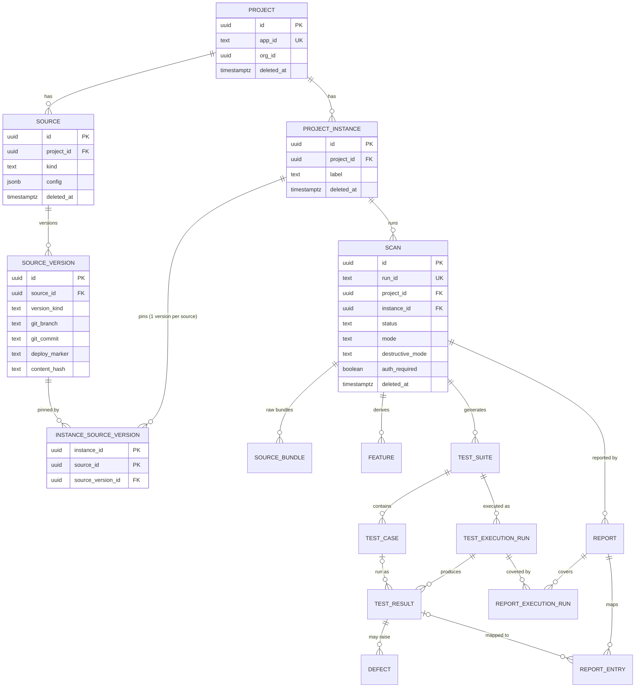
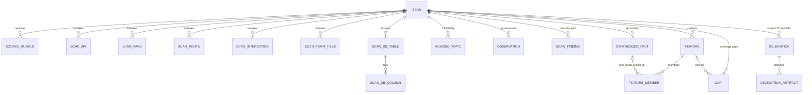
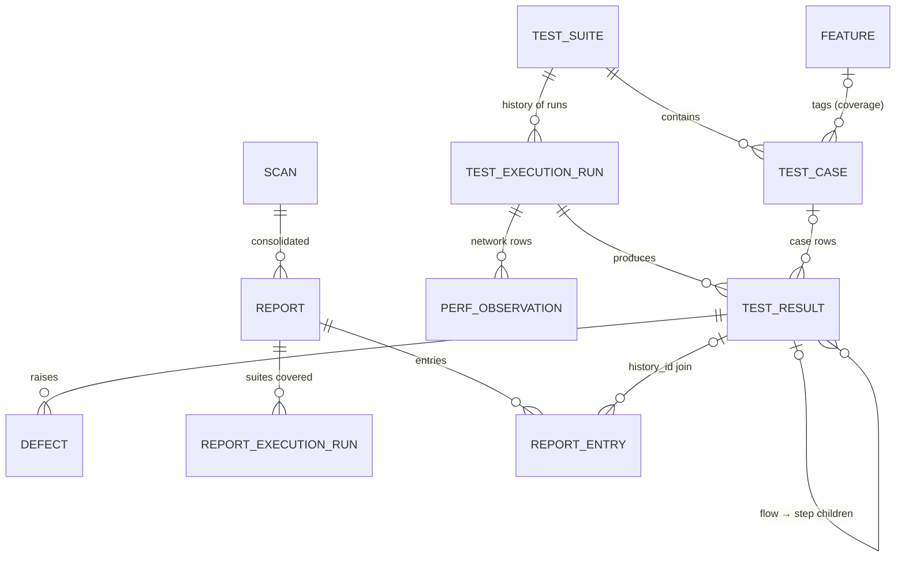
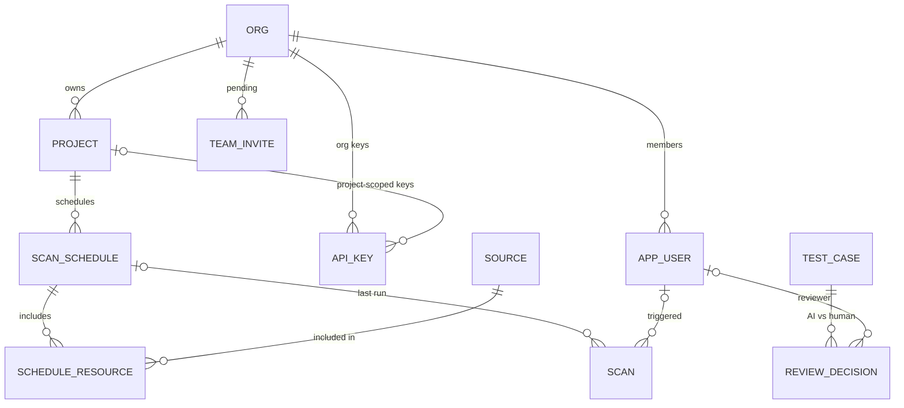
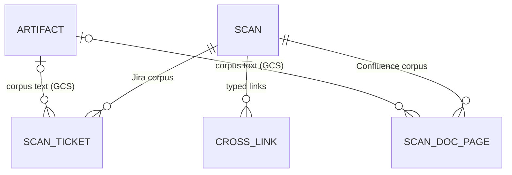

# Database Schema — finalized

_The canonical data-model reference for the AI Testing Hook. Supersedes the working draft in
`docs/spec-17-database-schema.md` (kept as design history). This version incorporates a
3-lens adversarial review (Postgres DDL validity · model-vs-real-artifacts fit · lifecycle/
secrets) — 41 findings, all adjudicated; the changelog is in §11._

**Stores:** one **Postgres** instance playing three logical roles — relational tables (this
document), a property graph (Apache AGE or the adjacency tables in §6), and **pgvector**
embeddings — plus a **GCS bucket** for blobs. `run_id` joins a Postgres row, a graph
subgraph, a vector row, and a `gs://<bucket>/<app_id>/<run_id>/…` prefix.

---

## 1. Conventions (apply to every table)

| Rule | Detail |
|---|---|
| PKs | `uuid` surrogate PKs; natural keys enforced by UNIQUE constraints/indexes |
| Scan scoping | every scan-derived row carries `scan_id`; two scans never share rows |
| Idempotency | every scan-scoped table has a **non-null unique arbiter** so loaders can `INSERT … ON CONFLICT … DO UPDATE`; nullable columns never appear in arbiter keys (PG15 `UNIQUE NULLS NOT DISTINCT` where sentinels are ugly) |
| ON DELETE policy | **CASCADE** inside a scan's subtree (deleting a `scan` removes everything it produced); **RESTRICT** across the identity spine (a project/instance/source with scans cannot be deleted until its scans are); **SET NULL** for optional artifact pointers |
| Soft delete | `deleted_at` on the 4 spine tables only (project, source, project_instance, scan) — children die with the scan. Live-name reuse via **partial unique indexes** (`WHERE deleted_at IS NULL`). App reads go through `visible_*` views (§8) |
| Secrets / DLP | **No raw secret ever becomes a row**: JWTs → claim *names* + sig hash; auth headers/cookies → sha256 fingerprints; URLs stored with userinfo + token-bearing query params stripped; `field_type='password'` values NULLed; bodies/screenshots live only in GCS behind `artifact.dlp_status`. Full per-column rules in §9 |
| Naming | no reserved words (`table_name`, `is_unique`, `column_type`); snake_case |
| Tenancy | `project.org_id NOT NULL`; org queries join `project` (RLS = open decision §12) |

---

## 2. ER overview — the spine



Key semantic (fixed in review): `instance_source_version` keys on **(instance_id,
source_id)** — an instance pins exactly **one version per source**, spans many sources, and a
`source_version` is reusable across instances. Version↔source integrity is a composite FK,
not a trigger.

---

## 3. DDL — identity spine (dependency order 1–8)

```sql
-- 1 ─────────────────────────────────────────────────────────────────────────
CREATE TABLE project (
  id          uuid PRIMARY KEY,
  app_id      text NOT NULL,                 -- external key; GCS prefix component
  org_id      uuid NOT NULL,                 -- tenancy (single-tenant: fixed default org)
  name        text NOT NULL,
  created_at  timestamptz NOT NULL DEFAULT now(),
  updated_at  timestamptz NOT NULL DEFAULT now(),
  deleted_at  timestamptz
);
CREATE UNIQUE INDEX project_app_id_live_uq ON project (app_id) WHERE deleted_at IS NULL;

-- 2 ─────────────────────────────────────────────────────────────────────────
CREATE TABLE credential_ref (                -- indirection: env-var NAMES only, never secrets
  id           uuid PRIMARY KEY,
  project_id   uuid NOT NULL REFERENCES project(id) ON DELETE CASCADE,
  purpose      text NOT NULL,                -- 'login'|'db_dsn'|'gcs'|'jira'
  env_var_name text NOT NULL,
  UNIQUE (project_id, purpose)
);

-- 3 ─────────────────────────────────────────────────────────────────────────
CREATE TABLE source (
  id                uuid PRIMARY KEY,
  project_id        uuid NOT NULL REFERENCES project(id) ON DELETE RESTRICT,
  kind              text NOT NULL,           -- 'live_link'|'git_repo'|'openapi'|'database'|'docs'
  name              text NOT NULL,
  config            jsonb NOT NULL DEFAULT '{}',   -- endpoints credential-free (§9)
  credential_ref_id uuid REFERENCES credential_ref(id) ON DELETE SET NULL,
  created_at        timestamptz NOT NULL DEFAULT now(),
  deleted_at        timestamptz
);
CREATE UNIQUE INDEX source_identity_live_uq ON source (project_id, kind, name)
  WHERE deleted_at IS NULL;

-- 4 ─────────────────────────────────────────────────────────────────────────
CREATE TABLE source_version (
  id            uuid PRIMARY KEY,
  source_id     uuid NOT NULL REFERENCES source(id) ON DELETE RESTRICT,
  version_kind  text NOT NULL,               -- 'git_commit'|'live_deploy'|'spec_version'|'db_snapshot'
  git_branch    text, git_commit text, committed_at timestamptz,          -- git_repo
  base_url      text, deploy_marker text, openapi_spec_version text,      -- live_link
  auth_state_fingerprint text,               -- sha256(auth-state.json), never the state itself
  observed_at   timestamptz NOT NULL DEFAULT now(),
  content_hash  text,                        -- incremental-scan primitive
  meta          jsonb NOT NULL DEFAULT '{}',
  UNIQUE (source_id, id)                     -- superkey; FK target for the pin below
);
-- identity: table constraints can't hold expressions → unique expression index
CREATE UNIQUE INDEX source_version_identity_uq ON source_version
  (source_id, version_kind, coalesce(git_commit,''), coalesce(deploy_marker,''), coalesce(content_hash,''));
-- (PG15+ alternative: UNIQUE NULLS NOT DISTINCT (source_id, version_kind, git_commit, deploy_marker, content_hash))

-- 5 ─────────────────────────────────────────────────────────────────────────
CREATE TABLE project_instance (
  id          uuid PRIMARY KEY,
  project_id  uuid NOT NULL REFERENCES project(id) ON DELETE RESTRICT,
  label       text NOT NULL,                 -- "release-2.1", "main@nightly", "pr-482 preview"
  created_at  timestamptz NOT NULL DEFAULT now(),
  deleted_at  timestamptz,
  UNIQUE (project_id, id)                    -- superkey; consistency FK target for scan
);
CREATE UNIQUE INDEX project_instance_label_live_uq ON project_instance (project_id, label)
  WHERE deleted_at IS NULL;

-- 6 ── the pin: (instance, source) → ONE version; integrity by composite FK ──
CREATE TABLE instance_source_version (
  instance_id       uuid NOT NULL REFERENCES project_instance(id) ON DELETE CASCADE,
  source_id         uuid NOT NULL REFERENCES source(id) ON DELETE RESTRICT,
  source_version_id uuid NOT NULL,
  PRIMARY KEY (instance_id, source_id),      -- one version per source per instance
  UNIQUE (instance_id, source_version_id),
  FOREIGN KEY (source_id, source_version_id)
    REFERENCES source_version (source_id, id) ON DELETE RESTRICT
);

-- 7 ─────────────────────────────────────────────────────────────────────────
CREATE TABLE scan (
  id                 uuid PRIMARY KEY,
  run_id             text NOT NULL UNIQUE,   -- 'run-<ISO8601>-<rand>' — cross-store join key
  project_id         uuid NOT NULL,
  instance_id        uuid NOT NULL,
  status             text NOT NULL,          -- 'running'|'ok'|'partial'|'failed'
  mode               text,                   -- execution mode: 'skill'|'cli' (run-summary.mode)
  destructive_mode   text,                   -- 'safe'|'full' (a different axis — split per review)
  auth_required      boolean,                -- tri-state; null = unknown (run-summary.authRequired)
  target             jsonb NOT NULL,         -- {baseUrl, codebase} — userinfo/token-params stripped
  pipeline_version   text, tool_manifest_hash text,   -- spec-12 provenance
  stats              jsonb NOT NULL DEFAULT '{}',     -- stages[], counts, consumable
  started_at         timestamptz NOT NULL DEFAULT now(),
  finished_at        timestamptz,
  deleted_at         timestamptz,
  UNIQUE (id, project_id),                   -- superkey; consistency FK target for children
  FOREIGN KEY (project_id, instance_id)      -- denorm project_id kept PROVABLY consistent
    REFERENCES project_instance (project_id, id) ON DELETE RESTRICT
);

-- 8 ── blob manifest: pointers + hashes only, bytes live in GCS ─────────────
CREATE TABLE artifact (
  id             uuid PRIMARY KEY,
  scan_id        uuid NOT NULL REFERENCES scan(id) ON DELETE CASCADE,
  classification text NOT NULL,              -- 'relational-source'|'graph-source'|'artifact'
  repo_rel_path  text NOT NULL,              -- output/… path
  gcs_uri        text,                       -- gs://<bucket>/<app_id>/<run_id>/<repo_rel_path>
  content_type   text, size_bytes bigint,
  sha256         text NOT NULL,              -- attribute, NOT part of identity (review fix)
  dlp_status     text NOT NULL DEFAULT 'pending',   -- 'pending'|'clean'|'redacted' — gates access
  created_at     timestamptz NOT NULL DEFAULT now(),
  UNIQUE (scan_id, repo_rel_path)            -- one object per path per run; rewrite = UPDATE
);
```

---

## 4. DDL — scan products: bundles + knowledge-graph entities (9–17)



```sql
-- 9 ─────────────────────────────────────────────────────────────────────────
CREATE TABLE source_bundle (
  id                uuid PRIMARY KEY,
  scan_id           uuid NOT NULL REFERENCES scan(id) ON DELETE CASCADE,
  source_id         uuid NOT NULL REFERENCES source(id) ON DELETE RESTRICT,
  source_version_id uuid REFERENCES source_version(id) ON DELETE RESTRICT,
  source_kind       text NOT NULL,           -- 'crawler'|'graphify'|'openapi-probe'|'mock-data'|'code-extractor:<id>'
  extracted_at      timestamptz, extracted_by text,
  stats             jsonb NOT NULL DEFAULT '{}',
  artifact_id       uuid REFERENCES artifact(id) ON DELETE SET NULL,
  UNIQUE (scan_id, source_id, source_kind)   -- two same-kind sources in one scan both fit (review fix)
);

-- 10 ── typed KG entities (arbiter keys are all non-null) ───────────────────
CREATE TABLE scan_api (
  id uuid PRIMARY KEY,
  scan_id uuid NOT NULL REFERENCES scan(id) ON DELETE CASCADE,
  natural_key text NOT NULL,                 -- "GET:/api/users" (indexer id)
  method text NOT NULL, path text NOT NULL, origin text,
  framework text, handler text, operation_id text, summary text, tags text[],
  auth_required boolean, observed_auth jsonb,        -- fingerprints only (§9)
  status_counts jsonb, content_types jsonb,
  request_schema_ref text, response_schemas jsonb, parameters jsonb,
  query_param_names text[], sample_count int,
  avg_request_ms numeric, avg_response_bytes numeric, triggered_by_pages text[],
  consensus text,
  UNIQUE (scan_id, natural_key)
);

CREATE TABLE scan_page (
  id uuid PRIMARY KEY,
  scan_id uuid NOT NULL REFERENCES scan(id) ON DELETE CASCADE,
  url text NOT NULL,                         -- canonical (query-stripped finalUrl)
  requested_urls text[],                     -- redirect fan-in preserved (review fix)
  url_variants jsonb,                        -- distinct query-states
  title text, lang text, section text, nav_status int, phase text, visited boolean,
  form_count int, clickable_count int, iframe_count int, image_count int,
  headings jsonb, meta jsonb,
  screenshot_artifact_id uuid REFERENCES artifact(id) ON DELETE SET NULL
);
CREATE UNIQUE INDEX scan_page_url_uq ON scan_page (scan_id, md5(url));  -- long-URL safe

CREATE TABLE scan_route (
  id uuid PRIMARY KEY, scan_id uuid NOT NULL REFERENCES scan(id) ON DELETE CASCADE,
  path text NOT NULL, frameworks text[], component text, auth_required boolean,
  UNIQUE (scan_id, path)
);

CREATE TABLE scan_interaction (
  id uuid PRIMARY KEY, scan_id uuid NOT NULL REFERENCES scan(id) ON DELETE CASCADE,
  natural_key text NOT NULL,                 -- indexer id "fromPage::elementSig" (review fix)
  from_page text, to_page text, kind text,
  element_text text, element_selector text, element_tag text,
  intent jsonb, api_call_hint text, navigates_to_path text, is_destructive boolean,
  UNIQUE (scan_id, natural_key)
);

CREATE TABLE scan_form_field (
  id uuid PRIMARY KEY, scan_id uuid NOT NULL REFERENCES scan(id) ON DELETE CASCADE,
  natural_key text NOT NULL,                 -- indexer id "page#form::field"
  page text, form_id text, form_action text, form_method text, form_intent text,
  field_name text, field_type text, required boolean, placeholder text,
  default_value text,                        -- NULL when password-typed (CHECK below, §9)
  autocomplete text,
  UNIQUE (scan_id, natural_key),
  CHECK (field_type IS DISTINCT FROM 'password' OR default_value IS NULL)
);

CREATE TABLE scan_redirect (
  id uuid PRIMARY KEY, scan_id uuid NOT NULL REFERENCES scan(id) ON DELETE CASCADE,
  from_url text NOT NULL, to_url text NOT NULL, kind text NOT NULL, status int,
  UNIQUE (scan_id, kind, from_url, to_url)
);

CREATE TABLE scan_model (
  id uuid PRIMARY KEY, scan_id uuid NOT NULL REFERENCES scan(id) ON DELETE CASCADE,
  name text NOT NULL, kind text, source_file text NOT NULL, fields jsonb, bases text[],
  UNIQUE (scan_id, name, source_file)
);

CREATE TABLE scan_db_table (                 -- reserved words renamed (review fix)
  id uuid PRIMARY KEY, scan_id uuid NOT NULL REFERENCES scan(id) ON DELETE CASCADE,
  table_name text NOT NULL, class_name text, source_file text, framework text,
  pk_columns text[], fk jsonb, relationships jsonb,
  UNIQUE (scan_id, table_name)
);
CREATE TABLE scan_db_column (
  id uuid PRIMARY KEY,
  table_id uuid NOT NULL REFERENCES scan_db_table(id) ON DELETE CASCADE,
  name text NOT NULL, column_type text,
  primary_key boolean, nullable boolean, is_unique boolean, indexed boolean,
  foreign_keys jsonb, autoincrement boolean,
  UNIQUE (table_id, name)
);

CREATE TABLE scan_dependency (
  id uuid PRIMARY KEY, scan_id uuid NOT NULL REFERENCES scan(id) ON DELETE CASCADE,
  name text NOT NULL, ecosystem text NOT NULL, version text, kind text,
  UNIQUE (scan_id, ecosystem, name)
);

-- 11 ── full-fidelity topic files (post-DLP form only — §9) ─────────────────
CREATE TABLE indexed_topic (
  id uuid PRIMARY KEY, scan_id uuid NOT NULL REFERENCES scan(id) ON DELETE CASCADE,
  topic text NOT NULL, item_count int, sources_contributing text[],
  payload jsonb NOT NULL,
  UNIQUE (scan_id, topic)
);

-- 12 ── per-fact provenance (polymorphic by convention; arbiter added) ──────
CREATE TABLE observation (
  id uuid PRIMARY KEY, scan_id uuid NOT NULL REFERENCES scan(id) ON DELETE CASCADE,
  entity_type text NOT NULL, entity_id uuid NOT NULL,
  source_id text NOT NULL, discovery_tier text, confidence numeric,
  source_file text, line_start int, line_end int, content_hash text
);
CREATE UNIQUE INDEX observation_uq ON observation
  (scan_id, entity_type, entity_id, source_id, coalesce(source_file,''), coalesce(line_start,-1));
CREATE INDEX ON observation (entity_type, entity_id);

-- 13 ─────────────────────────────────────────────────────────────────────────
CREATE TABLE scan_finding (
  id uuid PRIMARY KEY, scan_id uuid NOT NULL REFERENCES scan(id) ON DELETE CASCADE,
  category text NOT NULL,                    -- 'security'|'performance'|'failed-request'|'auth-observation'|'websocket'|'crawl-issue'
  finding_key text NOT NULL,                 -- producer-stable id, else sha256(canonical redacted detail)
  subject text, severity text,
  detail jsonb NOT NULL,                     -- REDACTED (jwt → claim names + sig hash — §9)
  UNIQUE (scan_id, category, finding_key)
);

-- 14 ─────────────────────────────────────────────────────────────────────────
CREATE TABLE synthesized_fact (
  id uuid PRIMARY KEY, scan_id uuid NOT NULL REFERENCES scan(id) ON DELETE CASCADE,
  fact_id text NOT NULL, kind text NOT NULL, key text NOT NULL,
  confidence numeric, payload jsonb NOT NULL,
  UNIQUE (scan_id, fact_id)
);

-- 15 / 16 ── features + members (composite FKs — scan-safe joins) ───────────
CREATE TABLE feature (
  id uuid PRIMARY KEY, scan_id uuid NOT NULL REFERENCES scan(id) ON DELETE CASCADE,
  feature_id text NOT NULL, name text, signal text, summary text,
  confidence numeric, member_count int, entrypoints text[], coverage jsonb,
  UNIQUE (scan_id, feature_id),
  UNIQUE (scan_id, id)                       -- superkey; FK target below
);
CREATE TABLE feature_member (
  feature_id  uuid NOT NULL,
  scan_id     uuid NOT NULL,
  member_type text NOT NULL,
  member_ref  text NOT NULL,                 -- synthesized_fact.fact_id
  PRIMARY KEY (feature_id, member_type, member_ref),
  FOREIGN KEY (scan_id, feature_id) REFERENCES feature (scan_id, id) ON DELETE CASCADE,
  FOREIGN KEY (scan_id, member_ref) REFERENCES synthesized_fact (scan_id, fact_id) ON DELETE CASCADE
);

-- 17 ─────────────────────────────────────────────────────────────────────────
CREATE TABLE gap (
  id uuid PRIMARY KEY, scan_id uuid NOT NULL REFERENCES scan(id) ON DELETE CASCADE,
  kind text NOT NULL, subject_fact_id text, subject jsonb, priority text, detail jsonb,
  feature_id uuid REFERENCES feature(id) ON DELETE SET NULL,
  FOREIGN KEY (scan_id, subject_fact_id) REFERENCES synthesized_fact (scan_id, fact_id)
);
CREATE UNIQUE INDEX gap_uq ON gap (scan_id, kind, coalesce(subject_fact_id, subject->>'key'));

-- 18 ── BYO-LLM delegations (junction replaces uuid[] — FK-enforceable) ─────
CREATE TABLE delegation (
  id uuid PRIMARY KEY, scan_id uuid NOT NULL REFERENCES scan(id) ON DELETE CASCADE,
  kind text NOT NULL, status text NOT NULL,  -- 'pending'|'fulfilled'|'skipped'
  reason text, item_count int,
  host_model text, prompt_schema_hash text, response_hash text,
  fulfilled_at timestamptz,
  UNIQUE (scan_id, kind)
);
CREATE TABLE delegation_artifact (
  delegation_id uuid NOT NULL REFERENCES delegation(id) ON DELETE CASCADE,
  artifact_id   uuid NOT NULL REFERENCES artifact(id) ON DELETE CASCADE,
  role text NOT NULL CHECK (role IN ('batch','schema')),
  ordinal int NOT NULL DEFAULT 0,
  PRIMARY KEY (delegation_id, artifact_id)
);
```

---

## 5. DDL — property graph + embeddings (19–22)

```sql
-- 19 / 20 ── adjacency form (AGE loads from these; endpoints FK-enforced) ───
CREATE TABLE graph_node (
  id uuid PRIMARY KEY, scan_id uuid NOT NULL REFERENCES scan(id) ON DELETE CASCADE,
  node_key text NOT NULL,                    -- "page:<url>", "intent:<cat>:<intent>", "api:<M>:<path>", code ids
  node_type text NOT NULL,                   -- page|route|intent|form|api|code_symbol|code_file
  props jsonb NOT NULL,                      -- projected from already-redacted Domain-C rows only
  UNIQUE (scan_id, node_key)
);
CREATE TABLE graph_edge (
  id uuid PRIMARY KEY, scan_id uuid NOT NULL REFERENCES scan(id) ON DELETE CASCADE,
  from_key text NOT NULL, to_key text NOT NULL,
  relation text NOT NULL,                    -- contains|contains-form|triggers|navigates_to|invokes|submits_to|realizes
  edge_key text NOT NULL DEFAULT '',         -- discriminator: parallel edges survive (review fix)
  props jsonb,
  UNIQUE (scan_id, from_key, to_key, relation, edge_key),
  FOREIGN KEY (scan_id, from_key) REFERENCES graph_node (scan_id, node_key) ON DELETE CASCADE,
  FOREIGN KEY (scan_id, to_key)   REFERENCES graph_node (scan_id, node_key) ON DELETE CASCADE
);
CREATE INDEX ON graph_edge (scan_id, to_key);            -- reverse traversal

-- 21 / 22 ── pgvector: untyped column, per-model partial HNSW indexes ───────
CREATE EXTENSION IF NOT EXISTS vector;
CREATE TABLE embedding (
  id uuid PRIMARY KEY, scan_id uuid NOT NULL REFERENCES scan(id) ON DELETE CASCADE,
  entity_type text NOT NULL, entity_ref text NOT NULL,
  chunk_text text NOT NULL,                  -- built from post-redaction rows only (§9)
  model text NOT NULL,
  vec vector NOT NULL,                       -- untyped: mixed dims across models (review fix)
  UNIQUE (scan_id, entity_type, entity_ref, model)
);
-- one partial index per model (indexes need a fixed dim; queries repeat the cast + WHERE):
-- CREATE INDEX embedding_hnsw_<model> ON embedding
--   USING hnsw ((vec::vector(1536)) vector_cosine_ops) WHERE model = '<model-id>';
```

---

## 6. DDL — tests, executions, results, defects, reports (23–30)



```sql
-- 23 ─────────────────────────────────────────────────────────────────────────
CREATE TABLE test_suite (
  id uuid PRIMARY KEY,
  scan_id uuid NOT NULL REFERENCES scan(id) ON DELETE CASCADE,
  kind text NOT NULL,                        -- 'api'|'ui'|'perf'
  name text NOT NULL DEFAULT '',             -- scenario.name; 'api-tests' for api
  plan_source text, config jsonb, generated_at timestamptz, stats jsonb,
  artifact_id uuid REFERENCES artifact(id) ON DELETE SET NULL,  -- suite blob: .ui.mjs | plan.jmx | curls/ (review fix)
  UNIQUE (scan_id, kind, name),
  UNIQUE (scan_id, id)                       -- superkey for run-consistency FK
);

-- 24 ── cases keyed by CONTENT, never position (review fix) ─────────────────
CREATE TABLE test_case (
  id uuid PRIMARY KEY,
  suite_id uuid NOT NULL REFERENCES test_suite(id) ON DELETE CASCADE,
  kind text NOT NULL,
  natural_key text NOT NULL,                 -- api: "GET:/api/x"; ui: hash(action+selector+label); perf: hash(method+path)
  step_index int,                            -- ordering only, NOT identity
  method text, path text, step_action text, selector text, value text,
  body jsonb,                                -- synthesized; secret-field names redacted (§9)
  feature_id uuid REFERENCES feature(id) ON DELETE SET NULL,   -- feature-slice tagging
  artifact_id uuid REFERENCES artifact(id) ON DELETE SET NULL, -- per-case blob: curls/<id>.sh
  UNIQUE (suite_id, natural_key)
);
CREATE INDEX ON test_case (feature_id);

-- 25 ── run history: nothing overwrites (fixes today's results.json clobber) ─
CREATE TABLE test_execution_run (
  id uuid PRIMARY KEY,
  suite_id uuid NOT NULL, scan_id uuid NOT NULL,
  mode text, started_at timestamptz, finished_at timestamptz,
  stats jsonb,                               -- totals, by_status, vitals, p50/p95/p99, login_summary
  FOREIGN KEY (scan_id, suite_id) REFERENCES test_suite (scan_id, id) ON DELETE CASCADE
);
CREATE INDEX ON test_execution_run (suite_id);

-- 26 ── results at TWO granularities: 'case' rows + 'flow'/'run' rows ───────
--   UI: one 'flow' row (vitals verdict, history_id md5('ui#'+scenario)) with
--   per-step 'case' children via parent_result_id.  Perf: per-sampler aggregates.
CREATE TABLE test_result (
  id uuid PRIMARY KEY,
  execution_run_id uuid NOT NULL REFERENCES test_execution_run(id) ON DELETE CASCADE,
  test_case_id uuid REFERENCES test_case(id) ON DELETE CASCADE,   -- NULL for flow/run rows
  parent_result_id uuid REFERENCES test_result(id) ON DELETE CASCADE,
  granularity text NOT NULL DEFAULT 'case',  -- 'case'|'flow'|'run'
  history_id text,                           -- api: md5('api#'+method+url) · ui: md5('ui#'+name) · perf: md5('perf#timing')
  status text NOT NULL,                      -- 'passed'|'failed'|'skipped'
  http_status int, timing_ms numeric, error text,
  measurements jsonb,                        -- perf aggregates p50/p95/p99/errorRate; vitals checks
  request jsonb, response_preview text,      -- BOTH scrubbed (§9)
  artifact_id uuid REFERENCES artifact(id) ON DELETE SET NULL,    -- runs/<id>.json | screenshot | results.jtl
  UNIQUE NULLS NOT DISTINCT (execution_run_id, test_case_id, granularity, parent_result_id)
);
CREATE INDEX ON test_result (history_id);    -- trend / flakiness across scans
CREATE INDEX ON test_result (test_case_id);

-- 27 ── caseless perf-timing rows (perf-timing.json network[]/routes[]) ─────
CREATE TABLE perf_observation (
  id uuid PRIMARY KEY,
  execution_run_id uuid NOT NULL REFERENCES test_execution_run(id) ON DELETE CASCADE,
  kind text NOT NULL,                        -- 'route'|'api'|'object'|'document'
  method text, url text, status int, duration_ms numeric, ttfb_ms numeric, detail jsonb
);
CREATE INDEX ON perf_observation (execution_run_id);

-- 28 ─────────────────────────────────────────────────────────────────────────
CREATE TABLE defect (
  id uuid PRIMARY KEY,
  test_result_id uuid NOT NULL REFERENCES test_result(id) ON DELETE CASCADE,
  scan_id uuid NOT NULL REFERENCES scan(id) ON DELETE CASCADE,
  title text, severity text, category text,  -- auth|perf-budget|ui-assert|5xx|4xx
  status text NOT NULL DEFAULT 'open',       -- 'open'|'triaged'|'resolved'
  mapping jsonb,
  video_artifact_id uuid REFERENCES artifact(id) ON DELETE SET NULL,
  created_at timestamptz NOT NULL DEFAULT now()
);
CREATE INDEX ON defect (scan_id); CREATE INDEX ON defect (test_result_id);

-- 29 ── reports are SCAN-scoped: allure/pdf consolidate ALL suites (review fix)
CREATE TABLE report (
  id uuid PRIMARY KEY,
  scan_id uuid NOT NULL REFERENCES scan(id) ON DELETE CASCADE,
  execution_run_id uuid REFERENCES test_execution_run(id) ON DELETE CASCADE,  -- only for single-suite reports (api report.md)
  kind text NOT NULL,                        -- 'allure'|'pdf'|'md'
  artifact_id uuid REFERENCES artifact(id) ON DELETE SET NULL,
  summary jsonb, generated_at timestamptz,
  UNIQUE NULLS NOT DISTINCT (scan_id, kind, execution_run_id)
);
CREATE TABLE report_execution_run (          -- which suite-runs a consolidated report covers
  report_id uuid NOT NULL REFERENCES report(id) ON DELETE CASCADE,
  execution_run_id uuid NOT NULL REFERENCES test_execution_run(id) ON DELETE CASCADE,
  PRIMARY KEY (report_id, execution_run_id)
);

-- 30 ─────────────────────────────────────────────────────────────────────────
CREATE TABLE report_entry (
  id uuid PRIMARY KEY,
  report_id uuid NOT NULL REFERENCES report(id) ON DELETE CASCADE,
  test_result_id uuid REFERENCES test_result(id) ON DELETE SET NULL,  -- history_id keeps the join
  history_id text NOT NULL,
  status text, status_detail text, attachments jsonb,
  UNIQUE (report_id, history_id)
);
CREATE INDEX ON report_entry (test_result_id);

-- 31 ─────────────────────────────────────────────────────────────────────────
CREATE TABLE audit_log (
  id bigserial PRIMARY KEY,
  entity_type text NOT NULL, entity_id uuid NOT NULL,
  action text NOT NULL,                      -- 'create'|'soft_delete'|'hard_delete'|'relink'|'rescan'
  actor text, at timestamptz NOT NULL DEFAULT now(), detail jsonb
);
CREATE INDEX ON audit_log (entity_type, entity_id);
```

**UI/perf identity, finalized (review blocker):** the allure reporter emits ONE result for a
whole UI flow (`historyId = md5('ui#'+scenarioName)`) and one for perf timing — so
`test_result` carries **granularity**: a `flow` row holds the flow verdict (incl. the
Web-Vitals fail-even-if-steps-pass case) and joins `report_entry`; per-step `case` rows hang
off it via `parent_result_id`. UI cases are keyed by content hash, never step position.

---

## 7. Store routing

| Store role | Objects |
|---|---|
| Postgres · relational | §3 + §4 + §6 tables (30 + audit_log) + §14 addendum (org, app_user, team_invite, auth_session, one_time_token, api_key, scan_schedule, schedule_resource, review_decision, scan_ticket, scan_doc_page, cross_link, member_project_access) = **44 tables** |
| Postgres · graph | `graph_node`, `graph_edge` (AGE loads from these; CTE fallback queries them directly) |
| Postgres · pgvector | `embedding` (untyped `vec`, per-model partial HNSW) |
| GCS bucket | screenshots · `curls/*.sh` · `*.ui.mjs` · `plan.jmx` · `results.jtl` · `allure-report/` · `report.pdf/html/md` · raw request/response bodies · `tool-runs/ctx-*.log` · `delegation/page-*.json` · `auth-state.json` (encrypted or fingerprint-only) · `storage-manifest.json` — every object has an `artifact` row |

---

## 8. Lifecycle: idempotency, soft delete, hard delete

- **Idempotent persist:** every scan-scoped table has a non-null arbiter (verified table by
  table in review) → `INSERT … ON CONFLICT … DO UPDATE`. Expression-index arbiters
  (`observation_uq`, `gap_uq`, `scan_page_url_uq`) require the loader to repeat the
  expressions in `ON CONFLICT`.
- **Soft delete:** `deleted_at` on the spine; reads via views —
  `visible_scan` = scan ⋈ instance ⋈ project where all `deleted_at IS NULL`; per-domain
  `visible_*` views layer on it. Partial unique indexes free names/labels/app_ids for reuse
  (note: a re-created `app_id` can collide with tombstoned GCS prefixes — include a
  generation suffix in the GCS layout, or block app_id reuse).
- **Hard delete:** `DELETE FROM scan WHERE id=…` cascades the entire subtree (every FK in
  §3–§6 declares it). The **application** must then delete the GCS `run_id` prefix and (if
  AGE) drop the scan's labeled subgraph — SQL cascades cannot reach either; both actions are
  written to `audit_log`.
- **Spine deletes RESTRICT:** a project/instance/source with live scans refuses deletion —
  scans go first, explicitly.

---

## 9. DLP / redaction rules (per column — mechanical, not aspirational)

| Column | Rule |
|---|---|
| `source.config`, `scan.target`, `source_version.meta` | endpoints credential-free: URL userinfo stripped, DSN passwords removed, token-bearing query params (`token,key,sig,access_token,code`) dropped; write path runs a secret-pattern lint |
| `scan_finding.detail` (auth-observation) | JWT → claim **names** + alg + sig-hash; never claim values (real bundle carries live emails/subs) |
| `test_result.request` | header allowlist; `Authorization/Cookie/X-API-Key/*-Token` → sha256 fingerprint; body denylist keys (`password,token,secret,api_key,otp`) redacted |
| `test_result.response_preview` | same scrub **before** truncation; `Set-Cookie` stripped; JWT-shaped substrings (`eyJ…`) replaced |
| `test_case.body` | secret-named fields redacted at generation |
| `scan_form_field.default_value/placeholder` | NULL when `field_type='password'` or autocomplete ∈ {current-password,new-password,one-time-code} (CHECK enforced) |
| `indexed_topic.payload` | the **post-DLP** form only; `mock-data` bodies → shapes + field names + fingerprints (raw bodies GCS-only behind `artifact.dlp_status`) |
| `graph_node/edge.props`, `embedding.chunk_text` | projected/built exclusively from already-redacted rows — never from raw bundles |
| `auth-state.json`, raw bodies, screenshots | GCS only; `artifact.dlp_status` gates access; separate DLP stage before any sharing |
| `scan_ticket.payload` / `scan_doc_page.payload` | **post-DLP form only** — ticket/doc text is a secret-paste vector (tokens, DSNs, passwords in bug reports); secret-pattern scrub before insert; full corpus text GCS-only behind `dlp_status` |
| `scan_ticket.assignee_display/reporter_display` | display **names** only — never emails (PII); excluded from export endpoints |

---

## 10. Keys & cross-run analytics

- **`run_id`** — the scan; joins all stores.
- **`project_id` / `app_id`** — tenancy; `org_id` on `project` (NOT NULL).
- **`history_id`** — stable per-test key across runs: `api: md5('api#'+method+url)` ·
  `ui: md5('ui#'+scenarioName)` (flow granularity) · `perf: md5('perf#timing')`. Indexed on
  `test_result` for trend/flakiness.
- **`source_version.content_hash` + `artifact.sha256`** — the incremental-scan primitives
  ("rescan only what changed"; skip-unchanged uploads).
- **Composite-FK consistency pattern** — every denormalized id (`scan.project_id`,
  `test_execution_run.scan_id`, `feature_member.scan_id`) is held consistent by a composite
  FK against a `UNIQUE(parent_key, id)` superkey — no triggers anywhere in the schema.

---

## 11. Changelog vs the spec-17 draft (review adjudication)

| # | Was | Now |
|---|---|---|
| 1 | `UNIQUE(…coalesce(…))` table constraint (invalid) | unique **expression index** `source_version_identity_uq` |
| 2 | tables in prose order (forward refs fail) | dependency-ordered 1–31 |
| 3 | reserved words `table`, `unique`, `type` | `table_name`, `is_unique`, `column_type` |
| 4 | `report.execution_run_id NOT NULL` | report is **scan-scoped** + `report_execution_run` junction (allure/pdf span suites) |
| 5 | one result per case only | `granularity` case/flow/run + `parent_result_id` (UI flow verdict, vitals) |
| 6 | no ON DELETE anywhere | full policy: CASCADE in-scan · RESTRICT spine · SET NULL pointers |
| 7 | 7 tables with no upsert arbiter | arbiters added (observation, scan_finding, gap, delegation, report, defect via result, exec_run via FK) |
| 8 | `delegation.input_artifact_ids uuid[]` | `delegation_artifact` junction (FK-enforceable, ordered, role) |
| 9 | `vector(1536)` fixed dim vs multi-model key | untyped `vec vector` + per-model partial HNSW indexes |
| 10 | nullable columns in arbiter keys (interaction, form_field) | indexer `natural_key` columns, NOT NULL |
| 11 | UI cases keyed by step position | content-hash keys; `step_index` = ordering only |
| 12 | `artifact` UNIQUE incl. sha256 | `UNIQUE(scan_id, repo_rel_path)`; sha256 an attribute |
| 13 | soft delete vs UNIQUE (names burned forever) | partial unique indexes `WHERE deleted_at IS NULL` |
| 14 | mock-data PII bodies in `indexed_topic` (contradiction) | post-DLP payloads only; raw bodies GCS-gated |
| 15 | `scan.mode` conflated safe/full with skill/cli | split: `mode` + `destructive_mode`; `auth_required` tri-state column |
| 16 | natural-key text joins across scans (feature_member, gap) | composite FKs on `(scan_id, fact_id)` |
| 17 | missing: perf per-iteration + caseless timing rows | `measurements` jsonb + `perf_observation` table |
| 18 | missing indexes (history_id, reverse edges, FK columns) | added throughout |
| 19 | `source_bundle` UNIQUE(scan_id, source_kind) | + `source_id` (two same-kind sources fit) |
| 20 | long-URL btree overflow risk | `md5(url)` unique index on scan_page |

---

## 12. Open decisions (carried)

1. **Graph backend** — Apache AGE (Cypher) vs the §5 adjacency tables + recursive CTEs. The
   adjacency tables ship either way (AGE loads from them). Blocked on: AGE availability in
   the managed Postgres.
2. **RLS** — enable row-level security keyed on `project_id`/`org_id`, or keep app-layer
   filtering through `visible_*` views.
3. **Retention** — scans kept per instance before pruning (GCS lifecycle exists; Postgres
   needs a number).
4. **DB-as-source inversion** — today `output/` JSON stays canonical and the DB is a
   projection; the flip is a later milestone.
5. **Embedding models** — which model(s) → which partial HNSW indexes get created.
6. **SSO provider** (screen 01) — which IdP backs `app_user.sso_subject`; email+password
   ships first (§14.1).
7. **CI provider set** for `projects/imports/ci` — GitHub / GitLab / Azure DevOps?
   (The former "permissions matrix" decision is resolved — §14.8 member_project_access.)

## 13. Verification plan

1. `psql -f` `001_schema.sql` (§3–§6) then `002_addendum.sql` (§14) against a clean
   PG16+pgvector(+AGE if available) → zero errors, incl. the `credential_ref` constraint
   drop/replace.
2. Load the real run (`run-2026-07-29…`): indexed topics → `scan_*` rows; counts must equal
   `index.json`; re-run the loader → row counts unchanged (idempotency).
3. Load `api-tests/results.json` + allure results → verify every `report_entry.history_id`
   resolves to a `test_result` (api) or a flow row (ui/perf).
4. Grep loaded rows for `eyJ` (JWT) / `Set-Cookie` / password values → zero hits (DLP).
5. Soft-delete a scan → invisible via `visible_*`, names reusable; hard-delete → subtree gone,
   audit rows present, GCS prefix + graph cleanup invoked.
6. Two branches of one git source → two instances → one scan each → diffable via `scan_id`.
7. Addendum round-trip: create org→user→project-scoped key → authenticate an ingest call by
   sha256 lookup; approve a test with an override → `review_decision` row appears in the
   divergence query; schedule with 2 resources → junction rows + `next_run_at` populated;
   revoke a key → 401 on next use, row retained with `revoked_at`.
8. Auth round-trip: register → login → access JWT verifies with `JWT_SECRET` and expires;
   refresh rotates (`rotated_from` chain); replaying the OLD refresh token revokes the
   chain and 401s; logout → refresh dead; forgot→reset consumes the `one_time_token`
   (single use — second redemption fails) and revokes all sessions.
9. Tickets/docs round-trip (§14.7): load a Jira corpus → `scan_ticket` rows + corpus
   artifacts (`dlp_status` gated); re-push → identical counts (expression-index ON
   CONFLICT); secret-grep `payload` columns for `eyJ`/DSN patterns → zero; reverse
   lookup on `cross_link (scan_id, to_type, md5(to_ref))` returns an epic's children;
   ticket/doc nodes appear in `graph_node` after projection.
10. Access round-trip (§14.8): grant a developer 2 projects → members list shows
    projectAccess.count=2 and projects list meta.accessibleToUser=2 for them; revoke →
    both drop; admin sees all regardless; project create with region/tier → fields
    round-trip on the list response.

---

## 14. v1.1 addendum — dashboard & access control (from spec-18)

_The API service + dashboard wireframes (spec-18) require identity, access-control, review,
and scheduling entities the v1.0 core didn't model. Same conventions as §1. Ships as
migration `002_addendum.sql` (the §3–§6 core is `001_schema.sql`). Three deltas vs the
spec-18 sketch, applying this doc's own review standards: **API keys are sha256-hashed**
(bcrypt is for low-entropy passwords; API keys are high-entropy random secrets, and a
bcrypt hash can't be looked up in O(1) — passwords in `app_user` keep bcrypt),
**`scan_schedule` resources use a junction table** (no array-FK columns — same fix as
`delegation_artifact`), and the scan trigger column is named **`trigger_kind`** (keyword
caution, same policy as the `table_name`/`is_unique` renames)._



### 14.1 Identity & team (wireframe screens 01–04)

```sql
-- 32 ── org becomes a real table (project.org_id / app_user.org_id gain an FK target)
CREATE TABLE org (
  id          uuid PRIMARY KEY,
  name        text NOT NULL,
  created_at  timestamptz NOT NULL DEFAULT now()
);
ALTER TABLE project ADD FOREIGN KEY (org_id) REFERENCES org(id) ON DELETE RESTRICT;

-- 33 ─────────────────────────────────────────────────────────────────────────
CREATE TABLE app_user (
  id             uuid PRIMARY KEY,
  org_id         uuid NOT NULL REFERENCES org(id) ON DELETE RESTRICT,
  email          text NOT NULL,
  name           text,
  password_hash  text,                        -- bcrypt (low-entropy secret); NULL for SSO-only
  sso_subject    text,                        -- IdP subject when SSO
  role           text NOT NULL CHECK (role IN
                   ('super_user','admin','developer','tester','reviewer')),
  status         text NOT NULL DEFAULT 'active',   -- 'active'|'invited'|'disabled'
  last_active_at timestamptz,
  created_at     timestamptz NOT NULL DEFAULT now(),
  deleted_at     timestamptz
);
CREATE UNIQUE INDEX app_user_email_live_uq ON app_user (org_id, email)
  WHERE deleted_at IS NULL;

-- 34 ─────────────────────────────────────────────────────────────────────────
CREATE TABLE team_invite (
  id          uuid PRIMARY KEY,
  org_id      uuid NOT NULL REFERENCES org(id) ON DELETE CASCADE,
  email       text NOT NULL,
  role        text NOT NULL CHECK (role IN
                ('super_user','admin','developer','tester','reviewer')),
  invited_by  uuid REFERENCES app_user(id) ON DELETE SET NULL,
  status      text NOT NULL DEFAULT 'pending',    -- 'pending'|'accepted'|'revoked'
  created_at  timestamptz NOT NULL DEFAULT now()
);
CREATE UNIQUE INDEX team_invite_pending_uq ON team_invite (org_id, email)
  WHERE status = 'pending';

-- 34b ── JWT refresh sessions (access tokens are stateless HS256, JWT_SECRET from env;
-- refresh tokens are opaque, hashed here so logout/revocation actually works).
-- Rotation: each refresh issues a new row with rotated_from = old row; presenting an
-- already-rotated token is a theft signal → revoke the whole chain.
CREATE TABLE auth_session (
  id            uuid PRIMARY KEY,
  user_id       uuid NOT NULL REFERENCES app_user(id) ON DELETE CASCADE,
  token_hash    text NOT NULL UNIQUE,          -- sha256(refresh token)
  rotated_from  uuid REFERENCES auth_session(id) ON DELETE SET NULL,
  user_agent    text, ip inet,
  created_at    timestamptz NOT NULL DEFAULT now(),
  expires_at    timestamptz NOT NULL,          -- ~14 d
  revoked_at    timestamptz
);
CREATE INDEX ON auth_session (user_id) WHERE revoked_at IS NULL;

-- 34c ── one generic single-use token table: invite-accept, password reset,
-- (future) email verification, SSE tickets. Always hashed, always expiring.
CREATE TABLE one_time_token (
  id          uuid PRIMARY KEY,
  kind        text NOT NULL CHECK (kind IN
                ('invite','password_reset','email_verify','sse_ticket')),
  token_hash  text NOT NULL UNIQUE,            -- sha256
  user_id     uuid REFERENCES app_user(id) ON DELETE CASCADE,
  invite_id   uuid REFERENCES team_invite(id) ON DELETE CASCADE,
  created_at  timestamptz NOT NULL DEFAULT now(),
  expires_at  timestamptz NOT NULL,            -- reset 30 min · invite 7 d · sse 60 s
  used_at     timestamptz                      -- single-use: set on redemption
);
CREATE INDEX ON one_time_token (expires_at);   -- cheap purge of expired rows
```

### 14.2 API keys & connection credentials (screen 05)

```sql
-- 35 ── machine auth. Key format: tk_<env>_<random>; only the hash is stored.
CREATE TABLE api_key (
  id           uuid PRIMARY KEY,
  org_id       uuid NOT NULL REFERENCES org(id) ON DELETE CASCADE,
  project_id   uuid REFERENCES project(id) ON DELETE CASCADE,   -- NULL = org-wide key
  label        text NOT NULL,
  key_prefix   text NOT NULL,                 -- display: "tk_live_••••8f2a"
  key_hash     text NOT NULL UNIQUE,          -- sha256(full key) — O(1) auth lookup
  scope        text NOT NULL DEFAULT 'full' CHECK (scope IN ('full','read_only')),
  created_by   uuid REFERENCES app_user(id) ON DELETE SET NULL,
  created_at   timestamptz NOT NULL DEFAULT now(),
  last_used_at timestamptz,
  revoked_at   timestamptz                    -- revoke = timestamp, list keeps the row
);

-- 36 ── credential_ref grows into the screen-05 "connection credentials" table.
-- Values NEVER in rows: secret_ref points at Secret Manager (server-side creds);
-- env_var_name remains the local-.env indirection for device-side creds.
ALTER TABLE credential_ref
  ADD COLUMN name             text,            -- "checkout-service deploy key"
  ADD COLUMN cred_type        text,            -- 'git_pat'|'jira_token'|'confluence_token'|'db_dsn'|'login'
  ADD COLUMN secret_ref       text,            -- Secret Manager resource name
  ADD COLUMN last_verified_at timestamptz,
  ADD COLUMN verify_status    text,            -- 'valid'|'expired'|'failed'|'untested'
  ADD COLUMN deleted_at       timestamptz;
ALTER TABLE credential_ref ALTER COLUMN env_var_name DROP NOT NULL;  -- server creds have secret_ref instead
ALTER TABLE credential_ref DROP CONSTRAINT credential_ref_project_id_purpose_key;
CREATE UNIQUE INDEX credential_ref_name_live_uq ON credential_ref (project_id, name)
  WHERE deleted_at IS NULL;                    -- several creds of one type per project (screen 05)
-- linked-resource counts derive from source.credential_ref_id — no extra storage.
```

### 14.3 Resource & scan state for the dashboard (screens 07–11)

```sql
-- 37 ── source connection state (Resources table columns)
ALTER TABLE source
  ADD COLUMN connection_status text,           -- 'connected'|'needs_attention'|'untested'
  ADD COLUMN last_verified_at  timestamptz;

-- 38 ── scan trigger provenance (device push vs dashboard vs schedule)
ALTER TABLE scan
  ADD COLUMN trigger_kind text NOT NULL DEFAULT 'device'
    CHECK (trigger_kind IN ('device','dashboard','schedule')),
  ADD COLUMN scan_type    text,                -- 'full'|'incremental'
  ADD COLUMN triggered_by uuid REFERENCES app_user(id) ON DELETE SET NULL;
```

### 14.4 Scheduled scans (screen 23)

```sql
-- 39 ─────────────────────────────────────────────────────────────────────────
CREATE TABLE scan_schedule (
  id                   uuid PRIMARY KEY,
  project_id           uuid NOT NULL REFERENCES project(id) ON DELETE CASCADE,  -- config, no scan data
  name                 text NOT NULL,
  cadence              jsonb NOT NULL,         -- {kind: daily|weekly|monthly|cron, at, dow?, dom?, cron?, tz}
  scan_config          jsonb,                  -- collapsed New-Scan options
  enabled              boolean NOT NULL DEFAULT true,
  notify_on_completion boolean NOT NULL DEFAULT false,
  notify_on_failure    boolean NOT NULL DEFAULT true,
  next_run_at          timestamptz,            -- scheduler poll key
  last_run_scan_id     uuid REFERENCES scan(id) ON DELETE SET NULL,
  created_at           timestamptz NOT NULL DEFAULT now(),
  deleted_at           timestamptz
);
CREATE UNIQUE INDEX scan_schedule_name_live_uq ON scan_schedule (project_id, name)
  WHERE deleted_at IS NULL;
CREATE INDEX ON scan_schedule (next_run_at) WHERE enabled AND deleted_at IS NULL;

-- 40 ── which resources a schedule includes (junction, not uuid[])
CREATE TABLE schedule_resource (
  schedule_id uuid NOT NULL REFERENCES scan_schedule(id) ON DELETE CASCADE,
  source_id   uuid NOT NULL REFERENCES source(id) ON DELETE CASCADE,
  PRIMARY KEY (schedule_id, source_id)
);
```

### 14.5 Human review & divergence (screens 13, 14, 22)

```sql
-- 41 ── review state lives ON the test case…
ALTER TABLE test_case
  ADD COLUMN classification text,              -- current (post-override) classification
  ADD COLUMN ai_confidence  numeric,           -- 0..1 from the host-LLM suggestion
  ADD COLUMN review_status  text NOT NULL DEFAULT 'pending'
    CHECK (review_status IN ('pending','approved','rejected','auto_approved')),
  ADD COLUMN edited_from_ai boolean NOT NULL DEFAULT false;

-- 42 ── …and every DECISION is an immutable event row (screen 22 = human ≠ AI rows)
CREATE TABLE review_decision (
  id                      uuid PRIMARY KEY,
  test_case_id            uuid NOT NULL REFERENCES test_case(id) ON DELETE CASCADE,
  scan_id                 uuid NOT NULL REFERENCES scan(id) ON DELETE CASCADE,
  ai_classification       text,
  ai_confidence           numeric,
  ai_reasoning            text,
  human_decision          text NOT NULL CHECK (human_decision IN ('approved','rejected')),
  classification_override text,                -- NULL = agreed with AI
  comment                 text,
  reviewer                uuid REFERENCES app_user(id) ON DELETE SET NULL,
  decided_at              timestamptz NOT NULL DEFAULT now()
);
CREATE INDEX ON review_decision (scan_id);
CREATE INDEX ON review_decision (test_case_id);
CREATE INDEX ON review_decision (decided_at);
```

### 14.6 Notes

- **Derived, not stored:** project-card rollups (screen 02), activity feeds (06/19),
  leaderboard (03), coverage tree (20), divergence stats (22) are queries over existing
  tables — no new storage.
- **ON DELETE policy extended:** org-scoped rows follow the spine rules — `org` RESTRICTs
  while projects exist; user references degrade to `SET NULL` (history survives people);
  schedules/keys are config → CASCADE with their owner.
- **DLP additions (§9 applies):** `credential_ref.secret_ref` is a *reference*, never a
  value; `api_key.key_hash` is one-way; invite emails are PII — exclude `app_user`/
  `team_invite` from any export endpoints.
- **Housekeeping (screen 24)** needs no new tables: soft/hard delete + restore act on
  `scan`/`report` via §8; `audit_log` (§6 #31) is the append-only log; per-item sizes =
  `sum(artifact.size_bytes)` grouped by scan.
- Table count: v1.0's 31 (30 + audit_log) + **12 new** (org, app_user, team_invite,
  auth_session, one_time_token, api_key, scan_schedule, schedule_resource,
  review_decision, §14.7's scan_ticket, scan_doc_page, cross_link, and §14.8's
  member_project_access) = **44**,
  plus ALTERs to project, credential_ref, source, scan, test_case.
- **Auth flow summary:** access = stateless JWT (HS256, `JWT_SECRET` from env/Secret
  Manager, TTL 30 min) — verified without a DB hit; refresh = opaque token hashed in
  `auth_session` with rotation + chain-revocation; logout revokes the session row;
  password reset / invite-accept / SSE tickets all ride `one_time_token`.

### 14.7 Tickets, doc pages & cross-links (Jira · Confluence — roadmap Phase 2)

_Proposed by the team; adjudicated against §1 conventions — approved with amendments:
renumbered #43–45 (the sketch's "22" collides with `embedding`), DLP rules extended
(A2), `method` CHECK added (A3), relationship to `graph_edge` made explicit (A4)._



```sql
-- 43 ── Jira tickets observed by a scan. Row = metadata; full ticket text
-- (description + comments) is a GCS corpus artifact (dlp_status-gated).
-- ⚠ DLP (§9): ticket text is a classic secret-paste vector (tokens/DSNs in bug
-- reports) — `payload` holds the POST-DLP form only; display NAMES only, never
-- emails (PII; excluded from export endpoints like app_user/team_invite).
CREATE TABLE scan_ticket (
  id uuid PRIMARY KEY,
  scan_id uuid NOT NULL REFERENCES scan(id) ON DELETE CASCADE,
  ticket_key text NOT NULL,                  -- "FRAUD-123"
  issue_type text, ticket_status text, priority text, summary text,
  epic_key text, parent_key text, labels text[], components text[],
  assignee_display text, reporter_display text,   -- names only — never emails
  created_at_source timestamptz, updated_at_source timestamptz,
  corpus_artifact_id uuid REFERENCES artifact(id) ON DELETE SET NULL,
  payload jsonb NOT NULL DEFAULT '{}',       -- post-DLP form only
  UNIQUE (scan_id, ticket_key)
);

-- 44 ── Confluence pages. Same pattern; same DLP rule on payload + corpus.
CREATE TABLE scan_doc_page (
  id uuid PRIMARY KEY,
  scan_id uuid NOT NULL REFERENCES scan(id) ON DELETE CASCADE,
  page_ref text NOT NULL,                    -- Confluence page id
  title text, space text, labels text[], ancestors jsonb, url text,
  doc_version int, updated_at_source timestamptz,
  corpus_artifact_id uuid REFERENCES artifact(id) ON DELETE SET NULL,
  payload jsonb NOT NULL DEFAULT '{}',       -- post-DLP form only
  UNIQUE (scan_id, page_ref)
);

-- 45 ── cross-linker output: typed links across entity families.
--   ticket↔code-file (git-log grep), ticket↔endpoint (known-literal match),
--   doc↔ticket (structural macros), doc↔doc, epic-contains, issue-link.
-- from/to refs are loose text (observation-style polymorphic precedent):
--   'ticket':<ticket_key> | 'doc':<page_ref> | 'code_file':<path> |
--   'api':<scan_api.natural_key> | 'fact':<synthesized_fact.fact_id>
CREATE TABLE cross_link (
  id uuid PRIMARY KEY,
  scan_id uuid NOT NULL REFERENCES scan(id) ON DELETE CASCADE,
  from_type text NOT NULL, from_ref text NOT NULL,
  to_type text NOT NULL,   to_ref text NOT NULL,
  link_type text NOT NULL,                   -- taxonomy: 'epic-contains'|'issue-link'|'documents'|
                                             --   'references-endpoint'|'mentioned-in-commit'|'doc-links-ticket'
                                             --   (documented, deliberately extensible — no CHECK)
  method text NOT NULL CHECK (method IN ('structural','literal-match','git-log','inferred')),
  confidence numeric,                        -- 0..1 (matches observation.confidence)
  detail jsonb
);
-- md5() digests keep long refs (urls/paths) inside btree limits — expression
-- index as arbiter; loaders repeat the expressions in ON CONFLICT (§8).
CREATE UNIQUE INDEX cross_link_uq ON cross_link
  (scan_id, from_type, md5(from_ref), to_type, md5(to_ref), link_type);
CREATE INDEX ON cross_link (scan_id, to_type, md5(to_ref));   -- reverse lookup
```

**cross_link vs `graph_edge` (A4 — the architecture rule):** `cross_link` is the
**relational source of record** for cross-family links — loose refs are legal (a
`code_file` need not exist as a `graph_node` unless graphify ran). For traversal,
ticket/doc/code nodes and their links are **projected into `graph_node`/`graph_edge`**
(node types `ticket|doc_page` join the existing set) — the same rows→graph projection as
Domain C→E. The feature-map (wireframe 21) then renders tickets/docs without new plumbing.

**Companion wiring:** `source.kind` gains documented values `'jira'` and `'confluence'`
(§3 #3 — the column has no CHECK, values are documented); ingest finalize (spec-18 §3.1)
maps `output/jira|confluence/bundle.json` via ticket/doc loaders, corpus text → GCS.

### 14.8 Project placement + per-project access (Global-pages API reconciliation)

_From the team's Global-pages API spec (absorbed into spec-18): project onboarding fields
confirmed as product fields, and per-project access grants — which **resolves the former
§12 open decision "permissions matrix"**: org role governs org pages; project visibility is
all-projects for `super_user`/`admin`, granted-rows-only for everyone else._

```sql
-- ALTERs: project onboarding + placement fields (team-confirmed)
ALTER TABLE project
  ADD COLUMN description text,
  ADD COLUMN region text,                    -- meta.regionCount derives from this
  ADD COLUMN tier text;

-- 46 ── per-project access grants
CREATE TABLE member_project_access (
  user_id    uuid NOT NULL REFERENCES app_user(id) ON DELETE CASCADE,
  project_id uuid NOT NULL REFERENCES project(id) ON DELETE CASCADE,
  granted_by uuid REFERENCES app_user(id) ON DELETE SET NULL,
  granted_at timestamptz NOT NULL DEFAULT now(),
  PRIMARY KEY (user_id, project_id)
);
CREATE INDEX ON member_project_access (project_id);
```

- **Access rule:** `meta.accessibleToUser` (projects list) = count of visible projects —
  all live projects for super_user/admin, else the member's granted rows. The `visible_*`
  views are unchanged (soft-delete only); ACL is enforced app-layer (or RLS per §12.2).
- `credential_ref.cred_type` documented values gain `'ci_provider'` (CI repo imports —
  `POST /v1/orgs/{orgId}/projects/imports/ci` resolves `connectionId` → a credential_ref).
