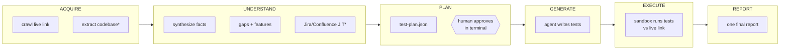

# Harness Use Cases

> Every place this project needs an LLM or an agent, end to end — what each one
> does, what it costs, and what happens when it's unavailable. This is the
> definitive list: if it's not in the catalog below, it doesn't call a model.
>
> Audience: us. This doc is the build blueprint and the team alignment surface.
> Engine constraint: GitHub Copilot only (SDK/CLI — see "Engine & seams").

---

## The one-line model

The harness is an **on-demand auditor**. You point it at a live application —
plus the codebase if we have access, plus Jira/Confluence credentials if we
have them — and one run does: observe → understand → plan → **you approve the
plan** → generate → execute → **one final report of all testing done**.

Three things this model deliberately is NOT:

- **Not a scheduler.** No nightly runs, no sprint sweeps, no CI hook. A human
  starts every run.
- **Not stateful.** Every run is a blank slate. No knowledge carries between
  runs; caching exists only *within* a run. The report is the only artifact.
- **Not a test-suite maintainer.** Generated tests are the means; the report
  is the product. Nothing gets merged into anyone's repo.

Jira and Confluence are not an intake queue — they are **just-in-time context
sources**. The harness pulls from them mid-run, when it needs them: documented
behavior for gap detection, acceptance criteria for scenario generation.

---

## Bird's-eye: one run, start to finish



\* = only if we were given access. The run completes either way — see
"Run profiles".

The LLM touchpoints hang off these stages. Everything else in the pipeline is
deterministic code (see "The deterministic backbone" for the boundary).

| ID | Use case | Stage | Shape | Phase | Fallback when degraded |
|---|---|---|---|---|---|
| **A1** | Test generation session | Generate | **Agent session** (multi-turn, tools) | P0 | template generator (exists) |
| S1 | Scenario ideation | Plan | single call per feature | P0 | gap-ranked template scenarios |
| S2 | Entity fuzzy-match | Understand | single call per residue pair | P0 | leave unmerged, confidence stays low |
| S3 | Jira/Confluence fact extraction | Understand + on demand in Generate | single call per document | P0 | source skipped, disclosed in report |
| S4 | Code semantic enrichment | Acquire | single call per entity (exists in graphify) | P0 | raw AST graph |
| S5 | Heal judge | Execute | single call per failure, **one cycle** | P1 | failure reported raw |
| S6 | Mock-data values | Generate | single call per schema | P1 | field-type defaults (planned anyway) |
| S7 | Button classification | Acquire | single call per button | P1 | regex classifier (exists) |
| S8 | Feature naming | Understand | single call per cluster | P2 | URL-prefix names |

One agentic use case. Eight single-shot ones. That's the entire LLM surface of
the project.

---

## The use-case catalog

### A1 — Test generation session (the one true agent)

The only place an LLM gets a tool loop. One Copilot SDK session per feature in
the approved plan. The session:

1. reads its slice of the plan (scenarios for this feature),
2. pulls context through MCP tools — `get_feature_context()` from our
   context-server, and Jira/Confluence via `mcp-atlassian` when the scenario
   references a ticket or documented behavior it hasn't seen,
3. writes the test files (Playwright UI specs, API tests),
4. syntax-validates its own output (the deterministic validator runs after it
   regardless).

- **In:** approved `test-plan.json` slice + MCP access to context.
- **Out:** runnable test files in the run workspace.
- **Tools it may call:** `get_feature_context`, `query_endpoints`, `list_gaps`
  (context-server); Jira/Confluence read tools (mcp-atlassian). It does NOT
  get execution tools — generation and execution are separate stages with the
  checkpoint's blessing between them.
- **Honesty rule (carried over from the OpenHarness days):** a session that
  ends without producing test files is a failed session, not a quiet success.
- **Degraded:** the deterministic template generator (today's
  `scripts/crawler/generator/`) produces what it can from crawl data alone;
  the report marks those features "template-generated".

### S1 — Scenario ideation

Turns one feature + its gaps into candidate test scenarios, before the
checkpoint. Single structured call per feature: feature facts + gap list in,
scenario list out (name, intent, endpoints/pages touched, mutation yes/no).
This is what fills `test-plan.json` — which the human then approves, so this
call's output is always reviewed before it costs us anything downstream.

- **Degraded:** scenarios come from templates ranked by gap severity. Duller,
  still reviewable.

### S2 — Entity-resolution fuzzy match

The knowledge-synthesizer canonicalizes and blocks deterministically;
whatever residue is still ambiguous (`/users/{id}` vs some crawl-observed
oddity) goes to a single yes/no match call per pair. Low volume **by design**
— if this gets expensive, the blocking is broken, not the budget.

- **Degraded:** residue stays unmerged. Same endpoint may appear twice with
  lower confidence each; the transparency section says so.

### S3 — Jira/Confluence fact extraction

When credentials are provided, the run pulls relevant tickets and pages via
`mcp-atlassian` (fetching is plain RPC — no LLM needed to *fetch*). The LLM
call is the *extraction*: unstructured AC text / documentation in, structured
facts out (declared endpoints, expected behaviors, constraints), which feed
gap analysis ("documented but never observed") and generation (A1 pulls the
same way mid-session). One call per document, cached by content hash for the
duration of the run.

- **Degraded:** the source is skipped entirely; gap analysis runs
  observed-vs-spec only, and the report's transparency section lists the
  documents that were never consulted.

### S4 — Code semantic enrichment

Exists today inside graphify: per-entity summaries layered on the
deterministic AST graph. Only runs when we have the codebase. Unchanged by
this design except for which engine serves the call.

- **Degraded:** raw AST graph. Structure survives; descriptions don't.

### S5 — Heal judge (P1)

When a generated test fails during execution: error + DOM snapshot go into a
single judge call, a patched test comes out, and it re-executes **once**. Both
attempts land in the report. This is not an agent loop — the retry logic is
orchestrator code, and one cycle is the hard cap. Its whole job is keeping
false failures (the classic AI-generated-selector fluke) from polluting the
report.

- **Degraded:** failures are reported raw, flagged "unhealed — judge
  unavailable".

### S6 — Mock-data values (P1)

Realistic domain-aware values for mutation-mode runs (a plausible IBAN beats
`"string"`). Single call per schema field-set. Safe-mode runs barely need it.

- **Degraded:** deterministic field-type defaults — which are the planned
  baseline anyway.

### S7 — Button classification (P1)

The crawler's safe-click long tail: buttons the regex can't confidently
classify go to a single safe/destructive/mutating call each. The existing
regex floor stays in force regardless — **the "Sign Out" rule is not the
LLM's call to make** (see safety floor below).

- **Degraded:** regex-only classification, exactly today's behavior.

### S8 — Feature naming (P2)

Readable labels for feature clusters ("Checkout" instead of `/api/v2/orders`).
Pure nicety for the report's app-map section.

- **Degraded:** URL-prefix names. Nobody suffers.

---

## The deterministic backbone (what does NOT call a model)

Bounding the list matters as much as the list. All of this is plain code, and
stays that way: the crawler BFS + network capture, all ~30 content extractors,
the indexer, provenance/confidence schema and noisy-OR fusion, the
knowledge-synthesizer core (canonicalize + block), gap-analyzer diffing,
feature clustering, the per-run knowledge store, the context-server MCP tools
(they *serve* an LLM; they contain none), the validator, the test executor,
allure/pdf reporters, and the mind-map builder. Fetching from Jira/Confluence
via MCP is scripted RPC, not an agent decision.

If someone proposes adding an LLM call outside the catalog above, this doc is
the place that proposal has to argue with.

---

## Engine & seams

One engine: the **GitHub Copilot SDK** (Python, GA June 2026 — same agent
runtime as Copilot CLI), living behind our existing `agentic-harness` seam.
Nothing else in the codebase knows Copilot exists.

```
┌─ orchestrator (Python, ours) ────────────────────────────────┐
│                                                              │
│  agentic-harness seam                                        │
│   ├─ agent mode:   Copilot SDK session  ──────── A1          │
│   └─ single mode:  Copilot SDK one-turn, no tools ── S1–S8   │
│                    (via model-api-connector, cached)         │
│                                                              │
│  MCPHost + SecretStore (credentials live here, only here)    │
│   ├─ context-server (ours)      ├─ mcp-atlassian             │
│   └─ local-git                  └─ sandbox-exec              │
│                                                              │
├─ sandbox (E2B) ── runs generated tests vs the live link ─────┤
│  no LLM, no credentials, explicit injection, teardown always │
└──────────────────────────────────────────────────────────────┘
```

- **Single mode = Tier-1.** Every S-call goes through `model-api-connector`
  with the SDK in one-turn/no-tools mode. All calls cached by content hash
  within the run. (If governance clears GitHub Models for batch inference,
  it slots in here as a cheaper backend — same connector interface, zero
  changes elsewhere.)
- **The OpenHarness backend chain (MiniMax/Kimi/Ollama) is retired.** Not
  sanctioned in the target environment, and the seam makes removal cheap.
- **Sandbox split is unchanged from the June decisions:** orchestrator hosts
  MCP servers and secrets; the sandbox only ever executes AI-written test
  code, with guaranteed teardown.

---

## Run policies

### Safe mode vs. full mode

Configurable per run, safe by default.

- **Safe mode (default):** GETs, navigation, non-mutating interaction only.
  Mutating tests (POST/PUT/DELETE, form submissions that write) are still
  *generated* — they appear in the report as `skipped: needs mutation-enabled
  environment`, so the coverage picture stays honest.
- **Full mode (explicit opt-in):** for test/staging/preview links we control.
  Mutations run for real; mock-data (S6) earns its keep here.
- **Safety floor (both modes, non-negotiable):** destructive-irreversible
  actions — sign-out, account deletion, revoke, disable — are never
  auto-exercised. This floor is regex-enforced in code, ahead of any LLM
  judgment (S7 classifies the long tail; it cannot override the floor).

### The checkpoint

After PLAN, the run pauses live in the terminal and shows a summary: feature
count, scenario count, which scenarios intend mutations, estimated request
budget. The operator approves or aborts; editing `test-plan.json` and
re-prompting is the escape hatch for surgical changes. Nothing executes
against the live application without this yes.

### Degradation

If Copilot is unavailable or the per-run request budget runs out mid-run, the
run does **not** die — every touchpoint falls back to its deterministic path
(the "Fallback" column above), and the report's transparency section states
exactly which use cases ran degraded. A report always comes out; a silently
worse report never does.

### Budget

Each run carries a request cap (Copilot premium requests are the unit that
bills). Within-run content-hash caching is the first line of cost control;
degradation is the second. The transparency section reports actual spend.

### Blank slate

The run workspace (`output/runs/<run-id>/`) holds everything a run produces
and is disposable. No cross-run knowledge store, no learned-skill memory, no
delta-vs-last-time in the report. If we ever want the learning loop back
(Acontext-style distillation was in the improvement roadmap), that's a new
design conversation — this doc's model is intentionally stateless.

---

## Run profiles

The harness runs with whatever access it's given; the report says what that
access did and didn't allow it to claim.

| Given | Unlocks | The report can say |
|---|---|---|
| Live URL only | crawl, observed endpoints/pages, UI+API+perf tests against observed surface | "tested what the app reveals" — no documented-vs-actual gap claims |
| + codebase | AST/route extraction, enrichment (S4), declared-vs-observed gap analysis, shadow-endpoint detection | "tested what the app reveals AND what the code declares" |
| + Jira/Confluence creds | documented behavior + ACs (S3), documented-but-absent gaps, AC-driven scenarios | full three-way audit: documented vs declared vs observed |

---

## The final report (the product)

Four sections, all mandatory:

1. **Test results** — API + UI + Perf pass/fail with reasons, screenshots,
   timings. The existing allure-reporter/pdf-reporter output, extended with
   heal annotations (original failure + patched retry, when S5 ran).
2. **Coverage & gap audit** — the signature section. What was tested, what
   was *not* tested and why: spec-declared-but-unobserved, shadow endpoints,
   documented-but-absent, mutation tests skipped by safe mode.
3. **App understanding map** — features, pages, endpoints, the mind-map. "Here
   is what the harness understood about your application" — the human-trust
   surface, and the first place to look when a result seems off.
4. **Run transparency** — which sources were available and consulted, which
   use cases ran degraded or skipped, LLM calls made and budget spent, mode
   (safe/full), confidence caveats.

---

## Phases

**P0 — first real report.** A1, S1, S2, S3, S4, the checkpoint, safe/full
modes, degradation, and all four report sections. Failures ship raw (no
healing). This is the smallest run that produces the product.

**P1 — report quality.** S5 heal cycle, S6 mock data, S7 button
classification. All three exist to make the report more truthful and more
complete, not to add capability.

**P2 — niceties.** S8 feature naming.

**Deliberately cut** (each was considered, none is in this design): the
scheduler and any CI/PR trigger; qa-bot; Code Mode runtime; the Copilot
coding-agent lane; skill-memory / cross-run learning; embeddings + pgvector
(a blank-slate run doesn't need semantic recall over its own facts).
