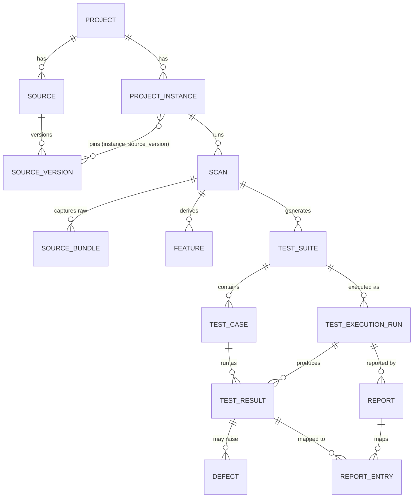

# Spec 17 — Database schema (Project → Sources → Instances → Scans → Tests → Reports)

> **➡ FINALIZED:** the reviewed, corrected schema lives in **`docs/DATABASE-SCHEMA.md`**
> (41 review findings adjudicated — see its §11 changelog). This file is the design
> history; where they differ, DATABASE-SCHEMA.md wins. Its `spec-10:NN` citations refer to
> the deleted spec-10 (superseded design history — recoverable from git).

_Design only — no code changes. Supersedes and details `spec-10`'s DDL sketch, grounded in the
actual pipeline output shapes (`output/indexed_output/*`, `output/generation/*`, the crawler +
graphify + feature-extractor bundles). Target stores: **Postgres · pgvector · Google Cloud Storage**._

> **TL;DR** — A top-down relational model: **Project** owns **Sources**; each source has
> **Versions**; a pinned combination of source-versions is a **Project Instance**; each instance
> runs **Scans**; a scan produces the **knowledge graph** (apis, pages, routes, clicks/interactions,
> intents, forms, db-schema, models, dependencies), **Features** (clusters), and **Tests**
> (suites → cases → executions → results → reports). Everything is keyed by `run_id` (the scan)
> and `project_id`/`app_id` (multi-tenant). Three physical stores: **Postgres** (relational rows +
> a property graph via Apache AGE + the pgvector extension for embeddings) and **GCS** (blobs:
> screenshots, curl/spec/jmx files, allure sites, PDFs, raw bodies). Postgres holds *pointers* to
> blobs, never the blob bytes.

---

## 0. The three stores — and the one thing to decide up front

The requested stores are **Postgres · pgvector · GCS**, but there's a load-bearing subtlety
(flagged in `spec-10:52`, `roadmap:167`): **pgvector does similarity search, not graph traversal.**
The click-graph (`page → intent → api`) and graphify code graph are *traversal* workloads.
So the honest mapping is **not** three peer databases — it's **two physical systems, Postgres
playing three logical roles**:

| Store (physical) | Logical role | Holds | Query style |
|---|---|---|---|
| **Postgres** | **relational** | the tables in this spec (project…report) | SQL joins |
| **Postgres** + **Apache AGE** (or JSONB adjacency) | **property graph** | `graph_node` / `graph_edge` (click-graph + graphify) | Cypher / recursive CTE |
| **Postgres** + **pgvector** extension | **vector** | `embedding` (semantic recall over apis/pages/features/docs) | ANN similarity |
| **GCS bucket** | **blob** | screenshots, `curls/*.sh`, `*.ui.mjs`, `plan.jmx`, `results.jtl`, allure site, `report.pdf`, raw bodies | object get by URI |

One Postgres instance = relational + graph + vector (all three are Postgres extensions), so
"3 data storages" reads as **Postgres (3 roles) + GCS**. If Apache AGE is unavailable in the target
Postgres, the graph falls back to the `graph_node`/`graph_edge` adjacency tables queried with
recursive CTEs (same schema, no AGE). **Decision to confirm: AGE vs adjacency-JSONB for the graph
role** (open item §12).

Cross-store join key: **`run_id`** (one scan) ties a Postgres row, a graph subgraph, a vector row,
and a `gs://<bucket>/<app_id>/<run_id>/…` prefix together (`spec-10:87`).

---

## 1. Top-down hierarchy (the spine)



Reading it in the user's words: a **project** has **sources**; sources have **versions** (live-link
deploy / git branch+commit); a **project instance** = a chosen combination of source-versions; each
instance has many **scans**; each scan holds the knowledge graph + features + apis/urls, generates
**test suites** (api/ui/perf) → **test cases**, which are **executed** into **results**, and
**reports** map back to exactly the results that were executed.

---

## 2. Domain A — Project, Sources, Versions, Instances

The identity/versioning axes the user asked about ("which can have different instances — live-link
version or git branches"). **Note (ground truth):** git branch/commit and live-deploy ids are
**not captured today** — the pipeline only has `baseUrl` + `auth-state.json` + `extractedAt` for live,
and an absolute path + `extractedAt` for code (git awareness is roadmapped, `roadmap:90-94`). The
schema provides the columns now so incremental/branch scanning drops in later.

```sql
-- The top level.
CREATE TABLE project (
  id            uuid PRIMARY KEY,
  app_id        text UNIQUE NOT NULL,          -- stable external key; GCS prefix + cross-app observability
  org_id        uuid,                          -- tenant (org-level dashboards)
  name          text NOT NULL,
  created_at    timestamptz NOT NULL DEFAULT now(),
  updated_at    timestamptz NOT NULL DEFAULT now(),
  deleted_at    timestamptz                    -- soft delete (roadmap:101)
);

-- A connectable input to the project. Type drives what a "version" means.
CREATE TABLE source (
  id            uuid PRIMARY KEY,
  project_id    uuid NOT NULL REFERENCES project(id),
  kind          text NOT NULL,                 -- 'live_link' | 'git_repo' | 'openapi' | 'database' | 'docs'
  name          text NOT NULL,                 -- e.g. "console-preview", "surface-backend repo"
  config        jsonb NOT NULL DEFAULT '{}',   -- url / repo remote / db host (NO secrets)
  credential_ref_id uuid REFERENCES credential_ref(id),  -- env-var NAME only, never a secret
  created_at    timestamptz NOT NULL DEFAULT now(),
  deleted_at    timestamptz,
  UNIQUE (project_id, kind, name)
);

-- One captured version of a source. Sparse — only the columns relevant to `kind` are filled.
CREATE TABLE source_version (
  id            uuid PRIMARY KEY,
  source_id     uuid NOT NULL REFERENCES source(id),
  version_kind  text NOT NULL,                 -- 'git_commit' | 'live_deploy' | 'spec_version' | 'db_snapshot'
  -- git_repo:
  git_branch    text,
  git_commit    text,                          -- 40-char sha (roadmap: branch awareness)
  committed_at  timestamptz,
  -- live_link:  (weak today → observed markers)
  base_url      text,
  deploy_marker text,                          -- build hash / deploy id when available…
  openapi_spec_version text,                   -- …else the probed spec.info.version (openapi-probe)
  auth_state_fingerprint text,                 -- sha256 of auth-state.json (session identity)
  -- universal:
  observed_at   timestamptz NOT NULL DEFAULT now(),  -- extractedAt fallback marker
  content_hash  text,                          -- sha256 over the source's canonical inputs (incremental-scan primitive)
  meta          jsonb NOT NULL DEFAULT '{}',
  UNIQUE (source_id, version_kind, coalesce(git_commit,''), coalesce(deploy_marker,''), coalesce(content_hash,''))
);

-- A named, pinned combination of source-versions = the thing a scan runs against.
CREATE TABLE project_instance (
  id            uuid PRIMARY KEY,
  project_id    uuid NOT NULL REFERENCES project(id),
  label         text NOT NULL,                 -- "release-2.1", "main@nightly", "pr-482 preview"
  created_at    timestamptz NOT NULL DEFAULT now(),
  deleted_at    timestamptz,
  UNIQUE (project_id, label)
);

-- The pin: for EACH source in the instance, exactly ONE version.
-- (instance, source) → source_version. The UNIQUE(instance_id, source_id)
-- is the semantic rule: an instance may span many sources (live_link +
-- git_repo + db), but can never pin two versions of the SAME source.
-- A source_version may be reused by many instances (main@c0ffee appears
-- in both "nightly" and "pr-482" instances).
CREATE TABLE instance_source_version (
  instance_id       uuid NOT NULL REFERENCES project_instance(id),
  source_id         uuid NOT NULL REFERENCES source(id),
  source_version_id uuid NOT NULL REFERENCES source_version(id),
  PRIMARY KEY (instance_id, source_id),          -- ⇐ one version per source per instance
  UNIQUE (instance_id, source_version_id)
  -- integrity: source_version.source_id must equal source_id (CHECK via trigger
  -- or composite FK (source_id, source_version_id) → source_version(source_id, id))
);
```

**How the linkage reads:** `project_instance` does not reference sources directly — the
junction does. Per source it is **one-to-one** (each source contributes exactly one pinned
version to the instance); across sources it is one-to-many (an instance pins one version
*of each* participating source); and version→instances is many (the same commit can sit in
several instances). Resolving "which URL/commit does this instance test" is one join:
`instance → instance_source_version → source_version`.

**Which sources can vary an instance?** Any source with a meaningful `source_version`:
- **git_repo** → varies by `git_branch` + `git_commit` (the main branch/commit axis).
- **live_link** → varies by `deploy_marker` (or `openapi_spec_version` / `auth_state_fingerprint` /
  `observed_at` as fallbacks until real deploy ids exist).
- **database** → `db_snapshot` (schema hash).
- **openapi / docs** → `spec_version` / content hash.

So instance = "live_link@deploy-abc + git_repo@main#c0ffee" — exactly the user's model.

---

## 3. Domain B — Scan (the run) + raw source bundles

```sql
CREATE TABLE scan (
  id             uuid PRIMARY KEY,
  run_id         text UNIQUE NOT NULL,          -- 'run-<ISO8601>-<rand>' — cross-store join key (ctx.mjs newRunId)
  project_id     uuid NOT NULL REFERENCES project(id),
  instance_id    uuid NOT NULL REFERENCES project_instance(id),
  status         text NOT NULL,                 -- 'running' | 'ok' | 'partial' | 'failed'
  mode           text,                          -- 'safe' | 'full' (destructive gating)
  target         jsonb NOT NULL,                -- {baseUrl, codebase} snapshot
  pipeline_version text,                        -- short-sha (spec-12:157 provenance)
  tool_manifest_hash text,                      -- pinned tool-manifest.json hash
  stats          jsonb NOT NULL DEFAULT '{}',   -- per-source ok/skip/duration (content-extraction-index.json)
  started_at     timestamptz NOT NULL DEFAULT now(),
  finished_at    timestamptz,
  deleted_at     timestamptz
);

-- One row per source per scan (the raw bundle envelope; big raw payload → GCS, pointer here).
CREATE TABLE source_bundle (
  id             uuid PRIMARY KEY,
  scan_id        uuid NOT NULL REFERENCES scan(id),
  source_id      uuid NOT NULL REFERENCES source(id),
  source_version_id uuid REFERENCES source_version(id),
  source_kind    text NOT NULL,                 -- 'crawler' | 'graphify' | 'openapi-probe' | 'mock-data' | 'db-schema' | 'code-extractor:<id>'
  extracted_at   timestamptz,
  extracted_by   text,                          -- provenance (bundle envelope)
  stats          jsonb NOT NULL DEFAULT '{}',
  artifact_id    uuid REFERENCES artifact(id),  -- the full bundle.json in GCS (blob)
  UNIQUE (scan_id, source_kind)
);
```

The scan fixes the `spec-12` gap ("no run_id/idempotency substrate", `spec-12:210`): every downstream
row carries `scan_id`, so runs are retained and diffable rather than overwritten.

---

## 4. Domain C — Knowledge-graph entities (the indexed "scan raw data")

These mirror `output/indexed_output/<topic>.json`. Each topic item is `{id, primary{}, observations[],
consensus}` (indexer `models.mjs`). Design choice: **typed tables for the entities the user named**
(apis, pages, routes, clicks/interactions, forms, features) for real columns + FKs, plus a generic
`indexed_topic` JSONB row per topic for full fidelity / the long tail. Provenance is modeled once in
`observation` and joined to any entity.

> **Why relational rows and not "the graph in pgvector"?** Three different query workloads
> need three different projections of the *same* scan data — and pgvector serves only one:
>
> | Question | Workload | Store |
> |---|---|---|
> | "all POST endpoints requiring auth that returned 5xx" | filter / join / aggregate | **Domain C rows (relational)** — also what `test_case`, `feature_member`, `report` FK against |
> | "what click path reaches `DELETE /api/users`?" | multi-hop traversal | **Domain E `graph_node`/`graph_edge`** (AGE/CTE) |
> | "find endpoints similar to 'user provisioning'" | semantic similarity | **Domain F `embedding`** (pgvector) |
>
> pgvector stores **vectors**, not edges — it has no relationship model and cannot traverse,
> so it can't hold the knowledge graph. The KG entities are written **once as rows here**
> (source of record + FK targets), **projected into Domain E** as nodes/edges for traversal,
> and **selectively embedded into Domain F** for recall. All three carry the same `scan_id`.

```sql
-- APIs / endpoints  (apis.json id = "METHOD:path"; merges code-extractors + live crawler)
CREATE TABLE scan_api (
  id            uuid PRIMARY KEY,
  scan_id       uuid NOT NULL REFERENCES scan(id),
  natural_key   text NOT NULL,                  -- "GET:/api/users"
  method        text NOT NULL,
  path          text NOT NULL,
  origin        text,                           -- live-observed
  framework     text, handler text, operation_id text, summary text,
  tags          text[],
  auth_required boolean,
  observed_auth jsonb,                          -- {bearer,cookie,none}
  status_counts jsonb, content_types jsonb,
  request_schema_ref text, response_schemas jsonb, parameters jsonb,
  query_param_names text[],
  sample_count  int,
  avg_request_ms numeric, avg_response_bytes numeric,
  triggered_by_pages text[],
  consensus     text,                           -- 'single-source' | 'agreed' | 'conflicting'
  UNIQUE (scan_id, natural_key)
);

-- Pages / URLs  (pages.json id = finalUrl query-stripped)
CREATE TABLE scan_page (
  id            uuid PRIMARY KEY,
  scan_id       uuid NOT NULL REFERENCES scan(id),
  url           text NOT NULL,                  -- canonical (query stripped)
  final_url     text, requested_url text,
  title         text, lang text, section text,
  nav_status    int, phase text, visited boolean,
  form_count    int, clickable_count int, iframe_count int, image_count int,
  headings      jsonb, meta jsonb,
  screenshot_artifact_id uuid REFERENCES artifact(id),   -- blob → GCS
  UNIQUE (scan_id, url)
);

-- Routes  (routes.json id = normalized path; frontend extractors)
CREATE TABLE scan_route (
  id uuid PRIMARY KEY, scan_id uuid NOT NULL REFERENCES scan(id),
  path text NOT NULL, frameworks text[], component text, auth_required boolean,
  UNIQUE (scan_id, path)
);

-- Clicks / interactions  (interactions.json id = "fromPage::elementSig"; click-graph edges + clickables)
CREATE TABLE scan_interaction (
  id uuid PRIMARY KEY, scan_id uuid NOT NULL REFERENCES scan(id),
  from_page text, to_page text,
  kind text,                                    -- 'page-transition'|'clickable-button'|'clickable-link'|'declared'
  element_text text, element_selector text, element_tag text,
  intent jsonb,                                 -- LLM-classified {intent,category,destructive,safeToClick,expectedApiCall}
  api_call_hint text, navigates_to_path text, is_destructive boolean,
  UNIQUE (scan_id, from_page, element_selector, to_page)
);

-- Form fields / test-data  (test-data.json id = "page#form::field")
CREATE TABLE scan_form_field (
  id uuid PRIMARY KEY, scan_id uuid NOT NULL REFERENCES scan(id),
  page text, form_id text, form_action text, form_method text, form_intent text,
  field_name text, field_type text, required boolean, placeholder text,
  default_value text, autocomplete text,
  UNIQUE (scan_id, page, form_id, field_name)
);

-- Redirects, models, db tables/columns, dependencies — same pattern (typed columns from §Scan-data map):
--   scan_redirect(scan_id, from, to, kind, status)
--   scan_model(scan_id, name, kind, source_file, fields jsonb, bases text[])
--   scan_db_table(scan_id, table, class_name, source_file, framework, pk_columns text[], fk jsonb, relationships jsonb)
--     scan_db_column(table_id, name, type, primary_key, nullable, unique, indexed, foreign_keys jsonb, autoincrement)
--   scan_dependency(scan_id, name, ecosystem, version, kind)

-- Generic fidelity layer: the full topic file, one JSONB row per topic per scan (spec-10:171).
CREATE TABLE indexed_topic (
  id uuid PRIMARY KEY, scan_id uuid NOT NULL REFERENCES scan(id),
  topic text NOT NULL,                          -- apis|pages|routes|models|redirects|test-data|dependencies|interactions|click-graph|db-schema|mock-data|openapi
  item_count int, sources_contributing text[],
  payload jsonb NOT NULL,                        -- the whole {topic,items[]} file (full fidelity)
  UNIQUE (scan_id, topic)
);

-- Per-fact provenance / lineage / staleness (indexer observations[]) — joined to ANY entity.
CREATE TABLE observation (
  id uuid PRIMARY KEY, scan_id uuid NOT NULL REFERENCES scan(id),
  entity_type text NOT NULL,                    -- 'api'|'page'|'route'|'interaction'|'db_table'|…
  entity_id   uuid NOT NULL,                     -- FK by convention (polymorphic)
  source_id   text NOT NULL,                     -- extractor id
  discovery_tier text,                           -- live_observed|ast|spec|graph_extracted|…
  confidence  numeric,                            -- 0..1
  source_file text, line_start int, line_end int, content_hash text
);
```

---

### 4b. Scan-output audit additions (found by diffing the schema against a real run's `output/`)

Four producers the first draft missed:

```sql
-- Crawler side-facts: authObservations / security / performance / failedRequests.
-- ⚠ DLP: facts.authObservations carries REAL JWT payloads (emails, sub, jti) and the
-- bearer-harvesting flow captures live tokens — persist FINGERPRINTS/summaries only;
-- raw claims and tokens never enter the DB (spec-12:120 rule extended to rows).
CREATE TABLE scan_finding (
  id uuid PRIMARY KEY, scan_id uuid NOT NULL REFERENCES scan(id),
  category text NOT NULL,          -- 'security'|'performance'|'failed-request'|'auth-observation'|'websocket'|'crawl-issue'
  subject text,                    -- cookie name, endpoint key, url
  severity text,                   -- for security findings (insecure cookie, missing header)
  detail jsonb NOT NULL            -- redacted payload (e.g. jwt claims → hash + claim NAMES only)
);

-- Knowledge-synthesizer output (output/synthesized/facts.json): canonical facts after
-- entity resolution + confidence fusion. Feature-extractor + gap-analyzer read THESE,
-- not the raw topics — so they need their own identity for feature_member/gap FKs.
CREATE TABLE synthesized_fact (
  id uuid PRIMARY KEY, scan_id uuid NOT NULL REFERENCES scan(id),
  fact_id text NOT NULL,           -- the synthesizer's factId (natural key)
  kind text NOT NULL,              -- 'endpoint'|'page'|'interaction'|'redirect'|…
  key text NOT NULL,               -- canonical key ("GET /api/x", url)
  confidence numeric,              -- fused confidence
  payload jsonb NOT NULL,
  UNIQUE (scan_id, fact_id)
);
-- feature_member.member_ref and gap.subject_fact_id resolve against synthesized_fact.fact_id.

-- Gap-analyzer output (output/gaps/gaps.json): coverage gaps with prioritization.
CREATE TABLE gap (
  id uuid PRIMARY KEY, scan_id uuid NOT NULL REFERENCES scan(id),
  kind text NOT NULL,              -- untested-endpoint | unreached-page | …
  subject_fact_id text,            -- → synthesized_fact.fact_id
  subject jsonb,                   -- {factId, kind, key} as emitted
  priority text, detail jsonb,
  feature_id uuid REFERENCES feature(id)   -- rolls up into feature.coverage
);

-- BYO-LLM delegations (output/delegation/run-*/ + run-summary.delegations[]): each
-- handoff of un-annotated clickables to the HOST model, with spec-12 provenance.
CREATE TABLE delegation (
  id uuid PRIMARY KEY, scan_id uuid NOT NULL REFERENCES scan(id),
  kind text NOT NULL,              -- 'crawler-intent' | future kinds
  status text NOT NULL,            -- 'pending' | 'fulfilled' | 'skipped'
  reason text,                     -- "CRAWLER_LLM=0 (skill mode): …"
  input_artifact_ids uuid[],       -- page-NNN.json batches + intent-schema.json (GCS)
  host_model text,                 -- model id/version that fulfilled it
  prompt_schema_hash text,         -- hash of the schema shipped to the host
  response_hash text,              -- hash of the raw host response (audit chain)
  fulfilled_at timestamptz
);
```

Also swept into existing tables: `output/tool-runs/ctx-<runId>.log` → an `artifact` row
(classification `'artifact'`) referenced from `scan`; `run-summary.json`'s `mode/stages/
counts/authRequired/consumable` → `scan.mode` + `scan.stats`; mock-data request/response
sample bodies stay in `indexed_topic` JSONB + GCS raw (never typed columns — they carry PII).

## 5. Domain D — Features (clusters over the knowledge graph)

`output/features/features.json` — a feature is a deterministic cluster of endpoints+pages+interactions
+redirects grouped by a structural `featureKey`.

```sql
CREATE TABLE feature (
  id uuid PRIMARY KEY, scan_id uuid NOT NULL REFERENCES scan(id),
  feature_id text NOT NULL,                     -- slug (natural key within scan)
  name text, signal text,                        -- "api-path+route-fragment"
  summary text, confidence numeric,              -- 0.5..1.0
  member_count int, entrypoints text[], coverage jsonb,
  UNIQUE (scan_id, feature_id)
);

-- Which knowledge-graph facts belong to a feature (endpoints/pages/interactions/redirects).
CREATE TABLE feature_member (
  feature_id uuid NOT NULL REFERENCES feature(id),
  member_type text NOT NULL,                     -- 'endpoint'|'page'|'interaction'|'redirect'|'other'
  member_ref  text NOT NULL,                     -- the fact id (e.g. api natural_key, page url)
  PRIMARY KEY (feature_id, member_type, member_ref)
);
```

Features are the natural grouping for test-plan scoping and org observability ("project health per
feature"). The **feature-slice resolver / tagging** flow (commit `ec125e8`) maps tests to features
for coverage analysis — modeled as a nullable `test_case.feature_id → feature(id)` FK (direct tag),
with the indirect join always available via `test_case.natural_key → feature_member.member_ref`.
`gap.feature_id` closes the loop: coverage gaps roll up per feature into `feature.coverage`.

---

## 6. Domain E — The property graph (traversable KG)

The richest object is `click-graph.json` (5 node types: pages, routes, intents, forms, apis; 7 edge
relations: contains, contains-form, triggers, navigates_to, invokes, submits_to, realizes) plus
graphify's code graph. Stored as a property graph.

```sql
-- Adjacency form (also the AGE fallback; under AGE these become a real labeled graph).
CREATE TABLE graph_node (
  id uuid PRIMARY KEY, scan_id uuid NOT NULL REFERENCES scan(id),
  node_key text NOT NULL,                        -- "page:<url>", "intent:<cat>:<intent>", "api:<M>:<path>", graphify node id
  node_type text NOT NULL,                       -- page|route|intent|form|api|code_symbol|code_file
  props jsonb NOT NULL,                           -- the node's fields
  UNIQUE (scan_id, node_key)
);
CREATE TABLE graph_edge (
  id uuid PRIMARY KEY, scan_id uuid NOT NULL REFERENCES scan(id),
  from_key text NOT NULL, to_key text NOT NULL,
  relation text NOT NULL,                         -- contains|triggers|navigates_to|invokes|submits_to|realizes|…
  props jsonb,
  UNIQUE (scan_id, from_key, to_key, relation)
);
```

Query with Apache AGE (`SELECT * FROM cypher('kg', $$ MATCH (p:page)-[:triggers]->(:intent)-[:invokes]->(a:api) RETURN … $$)`)
or, without AGE, recursive CTEs over `graph_edge` filtered by `scan_id`. Every node/edge is
scan-scoped so cross-scan diffs ("what changed") are `scan_id`-partitioned.

---

## 7. Domain F — pgvector embeddings (semantic recall)

The deferred `kb_embedding` entity (`spec-10:173`). One row per embeddable object; enables
"find endpoints/pages/features similar to X" and KB Q&A.

```sql
CREATE EXTENSION IF NOT EXISTS vector;
CREATE TABLE embedding (
  id uuid PRIMARY KEY, scan_id uuid NOT NULL REFERENCES scan(id),
  entity_type text NOT NULL,                     -- 'api'|'page'|'feature'|'doc'|'interaction'
  entity_ref  text NOT NULL,                      -- natural key of the source row
  chunk_text  text NOT NULL,                      -- what was embedded
  model       text NOT NULL,                      -- embedding model id (for re-embed invalidation)
  vector      vector(1536),                        -- dim per model
  UNIQUE (scan_id, entity_type, entity_ref, model)
);
CREATE INDEX ON embedding USING hnsw (vector vector_cosine_ops);
```

pgvector = similarity only; it does **not** replace Domain E's graph traversal — the two are
complementary (semantic recall vs relationship walk).

---

## 8. Domain G — Test generation → execution → results → defects

Suite (api/ui/perf) → case (per endpoint/step/sampler) → execution-run (history) → result → defect.

```sql
CREATE TABLE test_suite (
  id uuid PRIMARY KEY, scan_id uuid NOT NULL REFERENCES scan(id),
  kind text NOT NULL,                            -- 'api' | 'ui' | 'perf'
  name text,                                     -- scenario.name (ui/perf); 'api-tests' (api)
  plan_source text,                              -- 'apis.json' | 'scenario.json'
  config jsonb, generated_at timestamptz, stats jsonb,
  UNIQUE (scan_id, kind, name)
);

CREATE TABLE test_case (
  id uuid PRIMARY KEY, suite_id uuid NOT NULL REFERENCES test_suite(id),
  kind text NOT NULL,
  natural_key text NOT NULL,                     -- api: "GET:/api/x"; ui: step index; perf: sampler order
  method text, path text,                        -- api
  step_index int, step_action text, selector text, value text,   -- ui
  body jsonb,                                    -- synthesized request body / step payload
  artifact_id uuid REFERENCES artifact(id),      -- blob: curls/<id>.sh | <name>.ui.mjs | plan.jmx
  UNIQUE (suite_id, natural_key)
);

-- Fixes "each run overwrites results.json" — one row per suite execution → run history.
CREATE TABLE test_execution_run (
  id uuid PRIMARY KEY, suite_id uuid NOT NULL REFERENCES test_suite(id),
  scan_id uuid NOT NULL REFERENCES scan(id),
  mode text,                                     -- 'safe' | 'run'
  started_at timestamptz, finished_at timestamptz,
  stats jsonb                                    -- {total,passed,failed,skipped,by_status, vitals_*, p95…}
);

CREATE TABLE test_result (
  id uuid PRIMARY KEY,
  execution_run_id uuid NOT NULL REFERENCES test_execution_run(id),
  test_case_id uuid NOT NULL REFERENCES test_case(id),
  history_id text,                               -- md5("<kind>#<method><url>") — stable cross-run + report join key
  status text NOT NULL,                          -- 'passed' | 'failed' | 'skipped'
  http_status int, timing_ms numeric, error text,
  request jsonb,                                 -- redacted (auth stripped)
  response_preview text,
  artifact_id uuid REFERENCES artifact(id),      -- runs/<id>.json | screenshot | jtl row
  UNIQUE (execution_run_id, test_case_id)
);

-- NEW entity — results are pass/fail-only today (roadmap:170); required for observability + video mapping.
CREATE TABLE defect (
  id uuid PRIMARY KEY,
  test_result_id uuid NOT NULL REFERENCES test_result(id),
  scan_id uuid NOT NULL REFERENCES scan(id),
  title text, severity text, category text,      -- auth|perf-budget|ui-assert|5xx|4xx (allure categories)
  status text,                                   -- 'open'|'triaged'|'resolved'
  mapping jsonb,                                  -- endpoint/page/feature it maps to
  video_artifact_id uuid REFERENCES artifact(id),-- future: session video
  created_at timestamptz NOT NULL DEFAULT now()
);
```

---

## 9. Domain H — Reports (mapped to the tests they executed)

Allure emits **one result row per executed test** (`historyId` join key) plus a static HTML site
(blob); PDF is a pure blob. `report_entry` is the report ↔ executed-test mapping the user asked for.

```sql
CREATE TABLE report (
  id uuid PRIMARY KEY,
  execution_run_id uuid NOT NULL REFERENCES test_execution_run(id),
  scan_id uuid NOT NULL REFERENCES scan(id),
  kind text NOT NULL,                            -- 'allure' | 'pdf' | 'md'
  artifact_id uuid REFERENCES artifact(id),      -- allure-report/ site | report.pdf | report.md (blob → GCS)
  summary jsonb, generated_at timestamptz
);

-- One row per executed test that appears in the report (allure <uuid>-result.json).
CREATE TABLE report_entry (
  id uuid PRIMARY KEY,
  report_id uuid NOT NULL REFERENCES report(id),
  test_result_id uuid REFERENCES test_result(id),-- the executed test this entry reports
  history_id text NOT NULL,                       -- md5 join key (also matches when result row is absent)
  status text, status_detail text,
  attachments jsonb,                              -- attachment artifact refs
  UNIQUE (report_id, history_id)
);
```

`report_entry.test_result_id` + `history_id` give the explicit "report → executed test" mapping;
`report.artifact_id` points at the rendered blob in GCS.

---

## 10. Domain I — Cross-cutting (blobs, secrets, audit, soft-delete)

```sql
-- The GCS blob manifest (storage-manifest.json). Postgres holds the pointer + hash, never the bytes.
CREATE TABLE artifact (
  id uuid PRIMARY KEY, scan_id uuid NOT NULL REFERENCES scan(id),
  classification text NOT NULL,                  -- 'relational-source'|'graph-source'|'artifact'
  repo_rel_path text NOT NULL,                   -- output/… path
  gcs_uri text,                                  -- gs://<bucket>/<app_id>/<run_id>/<repo_rel_path>
  content_type text, size_bytes bigint, sha256 text NOT NULL,   -- idempotency: same run_id+path+sha256 → skip
  dlp_status text,                               -- 'pending'|'clean'|'redacted' (spec-12:120 bodies/screenshots)
  created_at timestamptz NOT NULL DEFAULT now(),
  UNIQUE (scan_id, repo_rel_path, sha256)
);

-- Credential indirection — env-var NAMES only, never secrets (spec-10:262-266).
CREATE TABLE credential_ref (
  id uuid PRIMARY KEY, project_id uuid REFERENCES project(id),
  purpose text,                                  -- 'login'|'db_dsn'|'gcs'|'jira'
  env_var_name text NOT NULL,                    -- e.g. 'LOGIN_PASSWORD', 'POSTGRES_DSN'
  UNIQUE (project_id, purpose)
);

-- Append-only audit trail (soft/hard delete, lifecycle, replace/re-link — roadmap:101).
CREATE TABLE audit_log (
  id bigserial PRIMARY KEY,
  entity_type text NOT NULL, entity_id uuid NOT NULL,
  action text NOT NULL,                          -- 'create'|'soft_delete'|'hard_delete'|'relink'|'rescan'
  actor text, at timestamptz NOT NULL DEFAULT now(), detail jsonb
);
```

Soft delete = `deleted_at` on `project` / `source` / `project_instance` / `scan`; hard delete cascades
`run_id` across Postgres rows + graph subgraph + the `gs://…/<run_id>/` prefix, logged in `audit_log`.

---

## 11. Store-routing map (which table → which store)

| Store role | Tables / objects |
|---|---|
| **Postgres — relational** | project, source, source_version, project_instance, instance_source_version, scan, source_bundle, scan_api/page/route/interaction/form_field/redirect/model/db_table/db_column/dependency, indexed_topic, observation, **scan_finding, synthesized_fact, gap, delegation**, feature, feature_member, test_suite, test_case, test_execution_run, test_result, defect, report, report_entry, artifact (manifest), credential_ref, audit_log |
| **Postgres — graph (AGE/adjacency)** | graph_node, graph_edge (click-graph + graphify) |
| **Postgres — pgvector** | embedding |
| **GCS bucket** | screenshots, `curls/*.sh`, `*.ui.mjs`, `plan.jmx`, `results.jtl`, `allure-report/`, `report.pdf/html/md`, raw response bodies, `tool-runs/ctx-*.log`, `delegation/run-*/page-*.json` batches, `auth-state.json` (encrypted or fingerprint-only), a copy of `storage-manifest.json` — each referenced by an `artifact` row |

---

## 12. Keys, idempotency, versioning, incremental scan

- **Primary join key:** `run_id` (scan) across all stores; `app_id`/`project_id` for tenancy.
- **Idempotency:** every scan-scoped table uses `UNIQUE (scan_id, natural_key)` → `INSERT … ON CONFLICT
  DO UPDATE` (`spec-10:175`), so re-persisting a run refreshes rather than duplicates.
- **Run history / versioning:** rows are never overwritten across scans — `scan_id` partitions
  everything, so two scans of the same instance are directly diffable (fixes today's overwrite).
- **Incremental / branch scanning:** `source_version.content_hash` (+ per-file `artifact.sha256`) is the
  "rescan only what changed" primitive; a new scan can reuse unchanged source_bundles from a prior scan
  of the same `source_version`.
- **Cross-run stability:** `test_result.history_id` = md5(kind#method#url) is the stable per-test key for
  trend/flakiness across scans.

---

## 13. Open decisions (confirm before DDL)

1. **Graph backend:** Apache AGE (real Cypher) vs `graph_node`/`graph_edge` adjacency + recursive CTE.
   AGE needs the extension available in the managed Postgres (`roadmap:167`).
2. **Multi-tenant shape:** one shared DB with `app_id`/`project_id` on every row (favored for org
   observability) vs DB-per-app (`spec-10:286`). This spec assumes shared + `project_id`.
3. **Typed tables vs pure JSONB** for the knowledge-graph entities: this spec does hybrid (typed core +
   `indexed_topic` JSONB). Confirm the typed set (apis/pages/routes/interactions/forms/features) is the
   right cut, or go fully generic.
4. **Retention:** how many scans kept before pruning (`spec-10:289`); GCS has lifecycle rules, Postgres
   needs an explicit policy.
5. **DB-as-source vs projection:** today JSON is canonical, DB is a projection (`spec-10:10`). When to
   invert so the DB is the source of truth (`spec-10:38`).
6. **Embedding dimension/model** for pgvector (drives `vector(N)` + re-embed policy).

---

## 14. Verification (how to prove the schema fits reality)

- Load one real run: map `output/indexed_output/*.json` items → `scan_*` + `indexed_topic` rows and
  confirm counts match `index.json` (apis/pages/interactions/etc.) — no data loss.
- `output/generation/api-tests/results.json` → `test_suite`/`test_case`/`test_execution_run`/`test_result`;
  confirm each `tests[]` row + `runs/<id>.json` + `curls/<id>.sh` lands with an `artifact` pointer.
- `allure-results/*-result.json` → `report`+`report_entry`; confirm `history_id` joins each entry to its
  `test_result`.
- Round-trip a scan through soft-delete → audit_log entry; hard-delete → confirm cascade across the
  `graph_*`, `embedding`, and GCS `run_id` prefix.
- Instance model: create 2 `source_version`s of one git source (two branches) + 1 live_link version →
  two `project_instance`s → one scan each → confirm they're independently queryable and diffable.
